# AI编程教练指南：从入门到精通的实战宝典

> **版本**: v1.0
> **作者**: Claude AI Programming Coach
> **日期**: 2025-09-21
> **适用对象**: AI编程新手 -> 高级开发者
> **核心目标**: 掌握AI编程最佳实践，高效开发中大型项目

---

## 🎯 教学目标与学习成果

### 学习目标
1. **掌握AI编程核心理念**：理解AI协作开发的原理和优势
2. **学会项目架构拆解**：将复杂项目分解为AI可处理的小模块
3. **优化Token使用效率**：最大化AI编程工具的投入产出比
4. **精通模块集成技巧**：高效整合独立开发的各个模块
5. **建立质量保证体系**：确保AI生成代码的质量和可维护性

### 预期成果
- 能够独立使用AI工具开发500-5000行的中大型项目
- 掌握从需求分析到项目上线的完整工作流
- 建立个人的AI编程方法论和工具库
- 具备debug复杂项目和性能优化的能力

---

## 📋 目录结构

1. [AI编程最佳实践流程](#1-ai编程最佳实践流程)
2. [项目架构拆解方法论](#2-项目架构拆解方法论)
3. [Token优化与模块整合策略](#3-token优化与模块整合策略)
4. [TradingAgent项目实战案例](#4-tradingagent项目实战案例)
5. [AI编程工作流与Prompt模板库](#5-ai编程工作流与prompt模板库)
6. [进阶技巧与最佳实践](#6-进阶技巧与最佳实践)
7. [常见问题与解决方案](#7-常见问题与解决方案)
8. [项目质量保证体系](#8-项目质量保证体系)

---

## 1. AI编程最佳实践流程

### 1.1 整体开发流程图

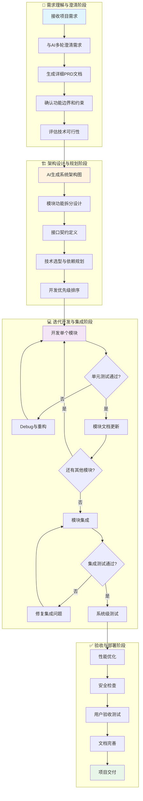

### 1.2 核心开发原则

#### 🔑 黄金法则
1. **单次对话单任务**：每次与AI的对话专注一个明确任务
2. **模块边界清晰**：确保模块间耦合度最小，内聚度最高
3. **接口优先设计**：先定义接口契约，再实现具体功能
4. **测试驱动开发**：先写测试用例，再实现功能代码
5. **文档与代码同步**：每完成一个模块立即更新文档

#### 🎨 AI协作艺术
```python
# AI编程协作模式
COLLABORATION_PATTERNS = {
    "设计师模式": "AI负责架构设计，人工负责决策确认",
    "编码助手模式": "AI负责代码实现，人工负责逻辑审查",
    "测试伙伴模式": "AI负责生成测试，人工负责用例设计",
    "文档助理模式": "AI负责文档生成，人工负责内容校对",
    "调试专家模式": "AI负责问题分析，人工负责解决方案"
}
```

---

## 2. 项目架构拆解方法论

### 2.1 架构拆解策略

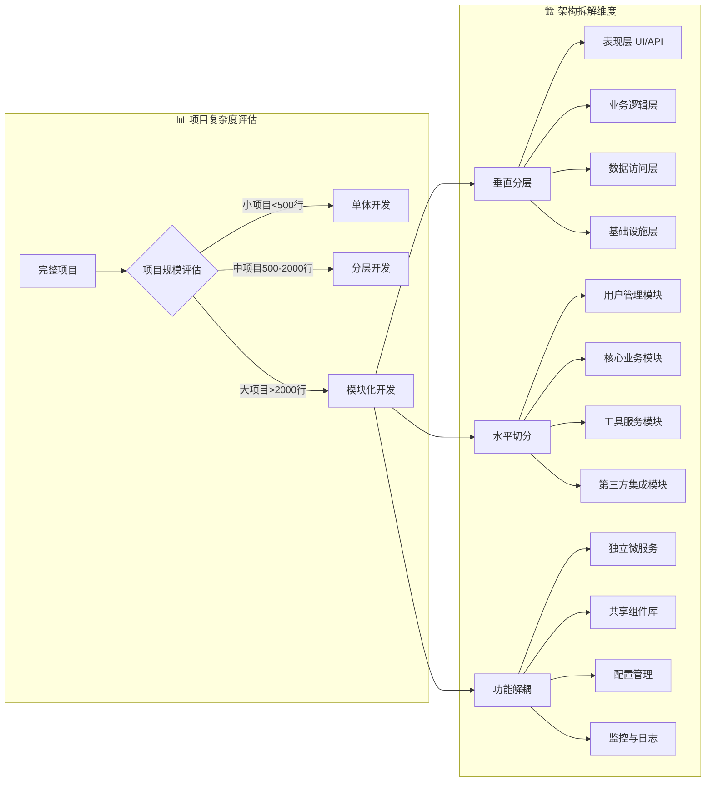

### 2.2 模块粒度控制标准

#### 🎯 AI可处理的模块标准
```python
MODULE_STANDARDS = {
    "代码量": {
        "最小": "100-200行",
        "理想": "200-500行",
        "最大": "500-800行"
    },
    "文件数": {
        "单文件": "简单工具模块",
        "2-3文件": "标准业务模块",
        "5-8文件": "复杂功能模块"
    },
    "依赖关系": {
        "输入依赖": "最多2-3个外部模块",
        "输出接口": "1-2个主要接口",
        "副作用": "明确且可控"
    },
    "开发时间": {
        "设计阶段": "30-60分钟",
        "实现阶段": "1-3小时",
        "测试调试": "30-90分钟"
    }
}
```

#### 🔧 模块拆分技巧

**1. 按数据流拆分**
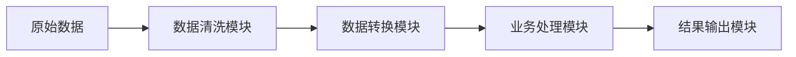

**2. 按职责拆分**
- **数据层模块**：负责数据的CRUD操作
- **业务层模块**：负责业务逻辑处理
- **服务层模块**：负责外部API调用
- **工具层模块**：负责通用工具函数

**3. 按生命周期拆分**
- **初始化模块**：系统启动和配置
- **处理模块**：核心业务逻辑
- **清理模块**：资源释放和状态保存

### 2.3 接口设计最佳实践

#### 📝 接口契约模板
```python
from typing import Dict, List, Optional, Union
from dataclasses import dataclass

@dataclass
class ModuleInterface:
    """模块接口标准模板"""

    # 输入接口
    def process(self,
                input_data: Dict[str, Any],
                config: Optional[Dict] = None) -> 'ModuleResult':
        """
        模块主处理接口

        Args:
            input_data: 输入数据，包含所有必要信息
            config: 可选配置参数

        Returns:
            ModuleResult: 标准化返回结果

        Raises:
            ValidationError: 输入数据格式错误
            ProcessingError: 处理过程中的业务异常
        """
        pass

    # 配置接口
    def configure(self, config: Dict[str, Any]) -> bool:
        """配置模块参数"""
        pass

    # 健康检查接口
    def health_check(self) -> Dict[str, Any]:
        """返回模块健康状态"""
        pass

@dataclass
class ModuleResult:
    """标准化返回结果"""
    success: bool
    data: Optional[Dict[str, Any]] = None
    error: Optional[str] = None
    metadata: Optional[Dict[str, Any]] = None
```

---

## 3. Token优化与模块整合策略

### 3.1 Token优化核心策略

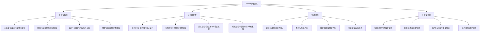

### 3.2 高效的Token使用技巧

#### 💡 上下文管理艺术
```python
# 上下文管理策略
CONTEXT_MANAGEMENT = {
    "必须保留": {
        "项目目标": "1-2句话概述",
        "架构概览": "简化的模块关系图",
        "当前任务": "明确的任务描述",
        "接口定义": "关键模块的接口签名"
    },

    "按需提供": {
        "实现代码": "只在需要修改时提供",
        "测试用例": "只在编写测试时展示",
        "配置文件": "只在配置相关任务时使用",
        "依赖关系": "只在集成时详细说明"
    },

    "及时清理": {
        "调试输出": "问题解决后立即删除",
        "中间版本": "确认最终版本后清理",
        "重复信息": "避免在多轮对话中重复",
        "过时设计": "架构变更后更新"
    }
}
```

#### 📊 Token使用效率评估
```python
def evaluate_token_efficiency(conversation_history):
    """评估Token使用效率"""

    metrics = {
        "信息密度": "有效信息 / 总Token数",
        "重复率": "重复内容Token / 总Token数",
        "任务完成度": "已完成任务 / 总任务数",
        "代码质量": "可用代码行数 / 生成代码行数"
    }

    # 优化建议
    optimization_tips = [
        "减少重复的背景介绍",
        "使用更精确的技术术语",
        "分离设计和实现讨论",
        "建立标准化的接口描述"
    ]

    return metrics, optimization_tips
```

### 3.3 模块集成最佳实践

#### 🔗 集成策略框架
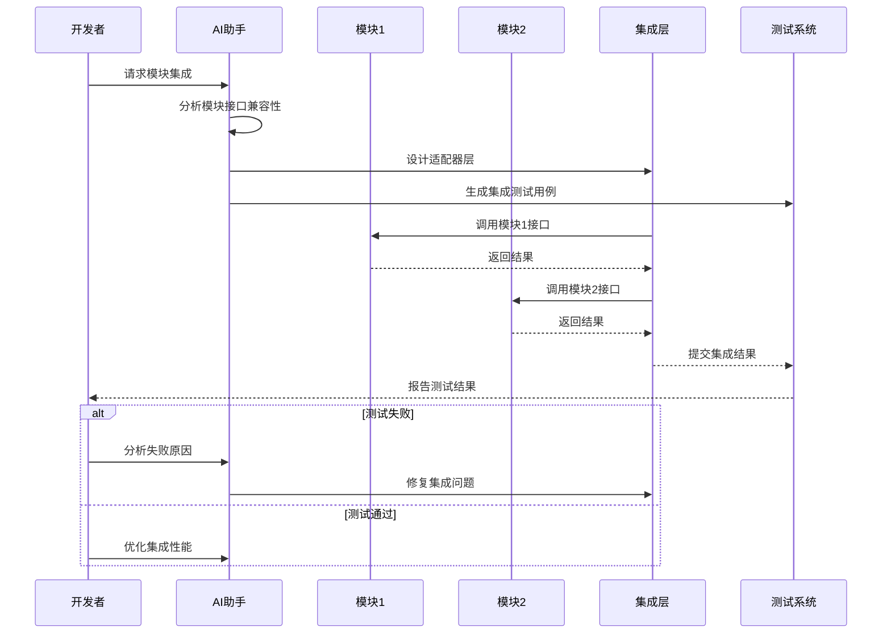

#### 🛠️ 集成检查清单
```python
INTEGRATION_CHECKLIST = {
    "接口兼容性": [
        "数据类型一致性检查",
        "参数传递格式统一",
        "返回值结构标准化",
        "异常处理机制对齐"
    ],

    "依赖管理": [
        "版本兼容性验证",
        "循环依赖检测",
        "资源冲突解决",
        "配置参数整合"
    ],

    "性能优化": [
        "数据传输效率",
        "内存使用优化",
        "并发安全保证",
        "错误恢复机制"
    ],

    "质量保证": [
        "单元测试覆盖",
        "集成测试验证",
        "错误场景测试",
        "性能基准测试"
    ]
}
```

---

## 4. TradingAgent项目实战案例

### 4.1 项目概览与需求分析

#### 📊 项目基本信息
```python
PROJECT_INFO = {
    "项目名称": "TradingAgents-CN-Akshare",
    "项目类型": "多智能体股票分析系统",
    "技术栈": "Python + Streamlit + LangGraph + AkShare",
    "代码规模": "~5000行",
    "模块数量": "15个核心模块",
    "开发周期": "预计4-6周"
}
```

#### 🎯 功能需求分解
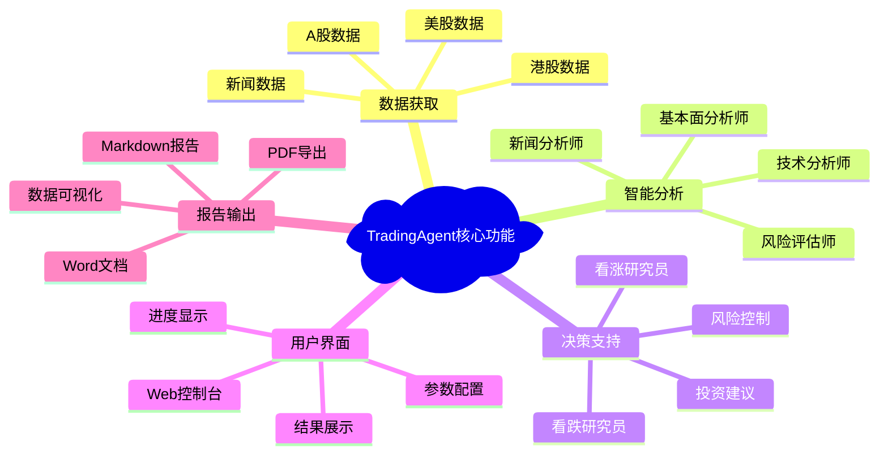

### 4.2 架构设计与模块拆分

#### 🏗️ 系统架构设计
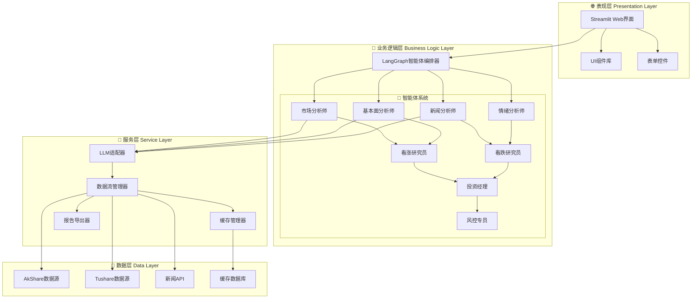

### 4.3 模块开发实战演练

#### 模块1: 数据获取层开发

**AI编程Prompt示例：**
```markdown
# 数据获取模块开发Prompt

## 任务描述
创建股票数据获取模块，支持A股、港股、美股的多源数据获取

## 功能要求
1. 支持AkShare和Tushare双数据源
2. 实现智能切换和容错机制
3. 提供统一的数据格式输出
4. 包含缓存机制避免重复请求
5. 完善的错误处理和日志记录

## 接口定义
```python
class StockDataFetcher:
    def get_stock_data(self, symbol: str, market: str,
                      date_range: tuple) -> StockData:
        pass

    def get_realtime_price(self, symbol: str) -> Price:
        pass
```

## 数据格式
```json
{
    "symbol": "000001",
    "name": "平安银行",
    "market": "A股",
    "price_data": [...],
    "volume_data": [...],
    "indicators": {...}
}
```

## 技术要求
- 使用asyncio提高并发性能
- 实现重试机制和超时控制
- 添加数据质量验证
- 支持批量数据获取
```

**AI生成的模块代码框架：**
```python
import asyncio
import logging
from typing import Dict, List, Optional, Tuple
from dataclasses import dataclass
from datetime import datetime, timedelta

@dataclass
class StockData:
    """股票数据标准格式"""
    symbol: str
    name: str
    market: str
    timestamp: datetime
    price_data: List[Dict]
    volume_data: List[Dict]
    indicators: Dict[str, float]

    def validate(self) -> bool:
        """数据质量验证"""
        return (
            self.symbol and
            self.price_data and
            len(self.price_data) > 0
        )

class StockDataFetcher:
    """股票数据获取器"""

    def __init__(self, config: Dict[str, Any]):
        self.config = config
        self.cache = {}
        self.logger = logging.getLogger(__name__)

    async def get_stock_data(self,
                           symbol: str,
                           market: str,
                           date_range: Optional[Tuple] = None) -> StockData:
        """获取股票数据主接口"""

        # 缓存检查
        cache_key = f"{symbol}_{market}_{date_range}"
        if cache_key in self.cache:
            self.logger.info(f"Cache hit for {symbol}")
            return self.cache[cache_key]

        try:
            # 数据源选择逻辑
            if market in ["A股", "A_STOCK"]:
                data = await self._fetch_china_stock(symbol, date_range)
            elif market in ["港股", "HK_STOCK"]:
                data = await self._fetch_hk_stock(symbol, date_range)
            elif market in ["美股", "US_STOCK"]:
                data = await self._fetch_us_stock(symbol, date_range)
            else:
                raise ValueError(f"Unsupported market: {market}")

            # 数据验证
            if data and data.validate():
                self.cache[cache_key] = data
                return data
            else:
                raise ValueError("Data validation failed")

        except Exception as e:
            self.logger.error(f"Failed to fetch data for {symbol}: {e}")
            # 尝试备用数据源
            return await self._fetch_fallback_data(symbol, market, date_range)

    async def _fetch_china_stock(self, symbol: str, date_range: Tuple) -> StockData:
        """获取A股数据"""
        # 实现具体的数据获取逻辑
        pass

    async def _fetch_fallback_data(self, symbol: str, market: str, date_range: Tuple) -> StockData:
        """备用数据源"""
        pass
```

#### 模块2: 智能体协作层开发

**AI编程Prompt示例：**
```markdown
# 智能体协作模块开发Prompt

## 任务描述
基于LangGraph框架创建多智能体协作分析系统

## 智能体角色定义
1. **市场分析师**: 技术指标分析
2. **基本面分析师**: 财务数据分析
3. **新闻分析师**: 舆情和新闻分析
4. **投资研究员**: 综合投资建议

## 协作流程
股票数据输入 → 并行分析 → 结果聚合 → 投资建议 → 风险评估

## 技术要求
- 使用LangGraph定义工作流
- 支持多LLM模型切换
- 实现智能体间的信息传递
- 提供分析过程的可视化
```

### 4.4 集成测试与部署

#### 🧪 集成测试策略
```python
# 集成测试用例设计
class IntegrationTest:

    def test_end_to_end_analysis(self):
        """端到端分析测试"""

        # 1. 数据获取测试
        stock_data = self.data_fetcher.get_stock_data("000001", "A股")
        assert stock_data.validate()

        # 2. 智能体分析测试
        analysis_result = self.trading_graph.analyze(stock_data)
        assert analysis_result.confidence > 0.5

        # 3. 报告生成测试
        report = self.report_generator.generate(analysis_result)
        assert len(report.content) > 1000

        # 4. 性能测试
        start_time = time.time()
        self.trading_graph.analyze(stock_data)
        duration = time.time() - start_time
        assert duration < 300  # 5分钟内完成
```

---

## 5. AI编程工作流与Prompt模板库

### 5.1 标准化工作流程

#### 📋 开发阶段工作流
```mermaid
flowchart LR
    subgraph "阶段1: 需求澄清"
        A1[需求收集] --> A2[AI需求分析]
        A2 --> A3[生成PRD]
        A3 --> A4[需求确认]
    end

    subgraph "阶段2: 架构设计"
        A4 --> B1[架构设计]
        B1 --> B2[模块拆分]
        B2 --> B3[接口定义]
        B3 --> B4[技术选型]
    end

    subgraph "阶段3: 开发实现"
        B4 --> C1[模块开发]
        C1 --> C2[单元测试]
        C2 --> C3[代码审查]
        C3 --> C4[文档更新]
    end

    subgraph "阶段4: 集成部署"
        C4 --> D1[模块集成]
        D1 --> D2[集成测试]
        D2 --> D3[性能优化]
        D3 --> D4[项目交付]
    end
```

### 5.2 Prompt模板库

#### 🎯 项目初始化Prompt
```markdown
# 项目初始化模板

## 项目基本信息
- **项目名称**: [项目名称]
- **项目类型**: [Web应用/桌面应用/API服务/数据分析等]
- **核心功能**:
  1. [核心功能1描述]
  2. [核心功能2描述]
  3. [核心功能3描述]

## 技术栈偏好
- **后端语言**: [Python/JavaScript/Java/Go]
- **前端框架**: [React/Vue/Streamlit/Flask]
- **数据库**: [PostgreSQL/MongoDB/Redis]
- **部署方式**: [Docker/云服务/本地部署]

## 约束条件
- **时间限制**: [预期完成时间]
- **性能要求**: [响应时间/并发量要求]
- **技术限制**: [必须使用的技术或避免的技术]

## 请帮我完成以下任务：
1. 🏗️ 设计系统架构图（使用Mermaid格式）
2. 📁 创建项目目录结构
3. 📋 列出核心模块及其职责
4. 🔗 定义模块间的接口契约
5. 📅 提供开发阶段规划和优先级建议
6. 🧪 推荐测试策略和工具
```

#### 🔧 模块开发Prompt
```markdown
# 单模块开发模板

## 模块信息
- **模块名称**: [模块名称]
- **模块职责**: [详细描述模块的职责和边界]
- **在系统中的位置**: [该模块在整体架构中的位置]

## 输入输出定义
### 输入接口
```python
def process_data(input_data: Dict[str, Any],
                config: Optional[Dict] = None) -> Result:
    """
    Args:
        input_data: [描述输入数据的格式和字段]
        config: [描述配置参数]
    """
    pass
```

### 输出格式
```json
{
    "status": "success|error",
    "data": {},
    "error_message": "string",
    "metadata": {}
}
```

## 功能要求
1. [功能要求1]
2. [功能要求2]
3. [功能要求3]

## 非功能要求
- **性能**: [响应时间/吞吐量要求]
- **可靠性**: [错误处理/重试机制]
- **可维护性**: [代码规范/日志记录]

## 依赖关系
- **输入依赖**: [依赖的其他模块或外部服务]
- **输出消费者**: [会使用此模块输出的其他模块]

## 请生成：
1. 完整的模块实现代码
2. 详细的错误处理机制
3. 完整的单元测试用例
4. 必要的日志记录
5. 模块使用示例
```

#### 🔗 模块集成Prompt
```markdown
# 模块集成模板

## 集成目标
将以下已完成的模块进行集成：

### 模块A：[模块名称]
- **功能**: [简述功能]
- **接口**: [关键接口签名]
- **输出格式**: [数据格式]

### 模块B：[模块名称]
- **功能**: [简述功能]
- **接口**: [关键接口签名]
- **输入要求**: [数据格式要求]

## 集成要求
1. **数据流转换**: [如果需要数据格式转换，请说明]
2. **错误传播**: [如何处理上游模块的错误]
3. **性能要求**: [对集成后性能的要求]
4. **监控需求**: [需要监控的关键指标]

## 集成模式
- [ ] 同步调用
- [ ] 异步处理
- [ ] 事件驱动
- [ ] 管道模式

## 请帮我：
1. 设计集成架构和数据流
2. 创建适配器代码（如果需要）
3. 实现错误处理和重试机制
4. 生成集成测试用例
5. 添加性能监控点
6. 提供集成部署建议
```

#### 🐛 Debug和优化Prompt
```markdown
# Debug优化模板

## 问题描述
- **错误类型**: [运行时错误/逻辑错误/性能问题]
- **发生场景**: [什么情况下出现问题]
- **错误信息**:
```
[粘贴完整的错误堆栈信息]
```

## 相关代码
```python
# 粘贴出现问题的关键代码片段
```

## 预期 vs 实际
- **预期行为**: [描述期望的结果]
- **实际行为**: [描述实际发生的情况]
- **影响范围**: [问题影响的功能范围]

## 环境信息
- **Python版本**: [版本号]
- **关键依赖版本**: [列出主要依赖包版本]
- **运行环境**: [本地/Docker/云服务器]

## 调试尝试
已经尝试过的解决方案：
1. [尝试1]
2. [尝试2]

## 请帮我：
1. 🔍 分析问题的根本原因
2. 🛠️ 提供具体的修复方案
3. 📝 解释为什么会出现这个问题
4. 🛡️ 提供预防类似问题的建议
5. 🧪 生成回归测试用例
```

### 5.3 质量保证Prompt模板

#### ✅ 代码审查Prompt
```markdown
# 代码审查模板

## 审查范围
请审查以下代码的：
- [ ] 功能正确性
- [ ] 代码规范性
- [ ] 性能效率
- [ ] 安全性
- [ ] 可维护性

## 代码内容
```python
[粘贴需要审查的代码]
```

## 审查标准
1. **功能性**: 代码是否正确实现了预期功能
2. **可读性**: 代码是否清晰易懂，变量命名是否合理
3. **性能**: 是否存在性能瓶颈或低效算法
4. **错误处理**: 异常处理是否完善
5. **安全性**: 是否存在安全漏洞
6. **测试覆盖**: 是否需要补充测试用例

## 请提供：
1. 🎯 总体评价和评分（1-10分）
2. ✅ 优点和做得好的地方
3. ⚠️ 需要改进的问题
4. 🔧 具体的修改建议
5. 📋 补充测试用例建议
```

---

## 6. 进阶技巧与最佳实践

### 6.1 AI编程的艺术与科学

#### 🎨 上下文工程艺术
```python
# 上下文工程的三层模型
CONTEXT_ENGINEERING = {
    "核心层": {
        "项目目标": "一句话概述",
        "当前模块": "正在开发的模块名",
        "核心接口": "3-5个关键接口定义",
        "数据格式": "主要的数据结构"
    },

    "支撑层": {
        "架构图": "简化的模块关系图",
        "技术栈": "核心技术和版本",
        "约束条件": "重要的技术约束",
        "质量要求": "关键的质量指标"
    },

    "扩展层": {
        "历史决策": "重要的设计决策记录",
        "已知问题": "当前存在的问题列表",
        "优化机会": "性能优化的机会点",
        "未来规划": "后续开发计划"
    }
}
```

#### 🔬 渐进式开发策略

**1. MVP优先开发**
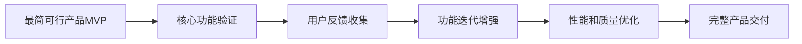

**2. 螺旋式迭代模式**
- **分析阶段**: 明确当前迭代的目标和范围
- **设计阶段**: 设计解决方案和接口
- **实现阶段**: AI辅助编码和测试
- **评估阶段**: 代码审查和质量评估

### 6.2 AI协作高级技巧

#### 💬 对话策略优化
```python
CONVERSATION_STRATEGIES = {
    "角色扮演": {
        "设计师角色": "系统架构师，注重设计的合理性",
        "编码者角色": "资深开发者，注重代码质量",
        "测试者角色": "QA工程师，注重功能验证",
        "运维角色": "DevOps工程师，注重部署和监控"
    },

    "分层思考": {
        "战略层": "项目目标和整体规划",
        "战术层": "具体的实现方案",
        "操作层": "详细的代码实现"
    },

    "迭代方式": {
        "垂直切片": "完整实现一个功能的所有层次",
        "水平分层": "先完成所有模块的接口定义",
        "风险优先": "先解决最有挑战性的问题"
    }
}
```

#### 📚 知识积累与复用

**建立个人AI编程知识库**
```markdown
knowledge_base/
├── prompts/
│   ├── project_init/          # 项目初始化模板
│   ├── module_development/    # 模块开发模板
│   ├── integration/           # 集成测试模板
│   └── optimization/          # 性能优化模板
├── patterns/
│   ├── design_patterns/       # 常用设计模式
│   ├── architecture_patterns/ # 架构模式
│   └── code_templates/        # 代码模板
├── lessons_learned/
│   ├── common_issues/         # 常见问题解决方案
│   ├── best_practices/        # 最佳实践总结
│   └── optimization_tips/     # 优化技巧
└── project_templates/
    ├── web_app/              # Web应用模板
    ├── api_service/          # API服务模板
    └── data_analysis/        # 数据分析模板
```

### 6.3 性能优化与扩展性

#### ⚡ 代码性能优化策略
```python
# 性能优化检查清单
PERFORMANCE_CHECKLIST = {
    "算法复杂度": [
        "时间复杂度是否最优",
        "空间复杂度是否合理",
        "是否存在不必要的嵌套循环",
        "数据结构选择是否合适"
    ],

    "I/O优化": [
        "数据库查询是否高效",
        "网络请求是否批量处理",
        "文件读写是否使用缓冲",
        "是否实现了适当的缓存策略"
    ],

    "并发处理": [
        "是否利用了多线程/异步处理",
        "锁的粒度是否合适",
        "是否存在死锁风险",
        "并发安全是否得到保证"
    ],

    "内存管理": [
        "是否存在内存泄漏",
        "大对象是否及时释放",
        "是否使用了内存池",
        "垃圾回收是否频繁"
    ]
}
```

#### 🔧 系统扩展性设计
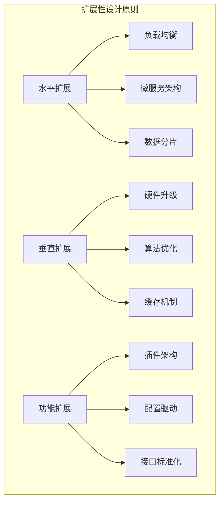

---

## 7. 常见问题与解决方案

### 7.1 技术问题解决指南

#### 🚨 常见问题分类

**1. 环境配置问题**
```python
ENVIRONMENT_ISSUES = {
    "依赖冲突": {
        "症状": "pip install失败或import报错",
        "解决方案": [
            "创建新的虚拟环境",
            "使用requirements.txt锁定版本",
            "检查Python版本兼容性",
            "使用conda管理复杂依赖"
        ]
    },

    "路径问题": {
        "症状": "模块找不到或文件路径错误",
        "解决方案": [
            "使用绝对路径",
            "正确设置PYTHONPATH",
            "检查工作目录",
            "使用相对路径时确保位置正确"
        ]
    }
}
```

**2. 代码集成问题**
```python
INTEGRATION_ISSUES = {
    "接口不匹配": {
        "问题": "模块间数据格式不一致",
        "解决": "创建适配器层统一数据格式",
        "预防": "严格定义接口契约"
    },

    "性能瓶颈": {
        "问题": "集成后性能下降",
        "解决": "使用profiler定位瓶颈，优化关键路径",
        "预防": "提前进行性能测试"
    },

    "错误传播": {
        "问题": "上游错误导致整个系统崩溃",
        "解决": "实现断路器模式和优雅降级",
        "预防": "设计容错机制"
    }
}
```

### 7.2 AI编程特有问题

#### 🤖 AI工具限制与应对

**1. 上下文长度限制**
```python
def handle_context_limit():
    """处理上下文长度限制的策略"""

    strategies = {
        "信息压缩": "只保留最关键的信息",
        "分阶段开发": "将大任务拆分为小任务",
        "外部存储": "将详细信息存储在外部文件中",
        "智能摘要": "用AI生成代码和设计的摘要"
    }

    return strategies
```

**2. 代码质量控制**
```python
def ensure_code_quality():
    """确保AI生成代码质量的方法"""

    quality_gates = [
        "静态代码分析工具检查",
        "单元测试覆盖率验证",
        "代码风格一致性检查",
        "性能基准测试",
        "安全漏洞扫描"
    ]

    return quality_gates
```

### 7.3 项目管理问题

#### 📋 项目进度控制
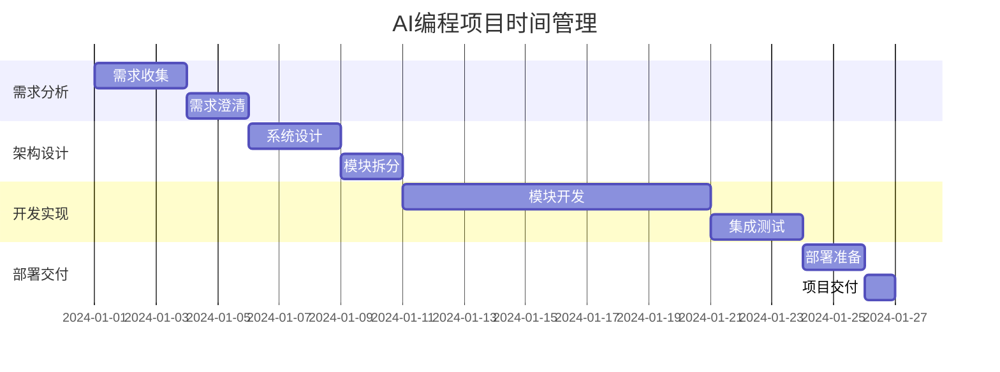

---

## 8. 项目质量保证体系

### 8.1 代码质量标准

#### 📏 质量评估维度
```python
QUALITY_DIMENSIONS = {
    "功能性": {
        "正确性": "功能实现是否符合需求",
        "完整性": "是否实现了所有必需功能",
        "适用性": "是否满足用户使用场景"
    },

    "可靠性": {
        "成熟性": "软件是否稳定可靠",
        "容错性": "是否具备良好的错误处理",
        "可恢复性": "故障后是否能快速恢复"
    },

    "易用性": {
        "可理解性": "接口和文档是否清晰",
        "可学习性": "新用户学习成本是否合理",
        "可操作性": "是否易于操作和使用"
    },

    "效率": {
        "时间特性": "响应时间是否满足要求",
        "资源利用性": "CPU和内存使用是否合理"
    },

    "可维护性": {
        "可分析性": "代码是否易于理解和分析",
        "可修改性": "是否易于修改和扩展",
        "稳定性": "修改后是否影响其他功能",
        "可测试性": "是否易于编写和执行测试"
    }
}
```

### 8.2 测试策略

#### 🧪 全面测试框架
```mermaid
pyramid
    title 测试金字塔

    "E2E Tests" : 10
    "Integration Tests" : 30
    "Unit Tests" : 60
```

**单元测试标准**
```python
# 单元测试最佳实践
class TestBestPractices:

    def test_should_follow_naming_convention(self):
        """测试函数命名应该清晰描述测试内容"""
        # Given: 准备测试数据
        input_data = {"symbol": "AAPL", "market": "US"}

        # When: 执行被测试功能
        result = stock_analyzer.analyze(input_data)

        # Then: 验证结果
        assert result.success == True
        assert result.confidence > 0.5
        assert "AAPL" in result.symbol

    def test_should_handle_invalid_input(self):
        """测试异常输入处理"""
        with pytest.raises(ValidationError):
            stock_analyzer.analyze({"invalid": "data"})
```

### 8.3 部署与监控

#### 🚀 部署检查清单
```yaml
deployment_checklist:
  环境准备:
    - 生产环境配置检查
    - 依赖版本确认
    - 环境变量设置
    - 数据库连接测试

  代码质量:
    - 代码审查通过
    - 测试覆盖率 >= 80%
    - 静态分析无重大问题
    - 安全扫描通过

  性能验证:
    - 负载测试通过
    - 响应时间满足要求
    - 内存使用正常
    - 并发处理能力验证

  监控配置:
    - 日志系统配置
    - 性能监控设置
    - 告警规则配置
    - 备份策略确认
```

#### 📊 监控指标体系
```python
MONITORING_METRICS = {
    "业务指标": [
        "API调用成功率",
        "平均响应时间",
        "用户活跃度",
        "功能使用率"
    ],

    "技术指标": [
        "CPU使用率",
        "内存使用率",
        "磁盘I/O",
        "网络延迟"
    ],

    "质量指标": [
        "错误率",
        "崩溃率",
        "可用性",
        "数据准确性"
    ]
}
```

---

## 🎓 总结与进阶路径

### 核心要点回顾

1. **AI编程的本质**：AI是强大的编程助手，但项目的方向、架构设计和质量把控仍需要人工主导

2. **模块化开发**：将复杂项目拆解为AI可以高效处理的小模块是成功的关键

3. **上下文管理**：有效的Token使用和上下文管理能够显著提高开发效率

4. **质量保证**：建立完善的测试和质量保证体系，确保AI生成代码的可靠性

5. **持续学习**：AI工具在快速发展，保持学习和实践是持续提高的必要条件

### 进阶学习路径

```mermaid
roadmap
    title AI编程能力进阶路径

    section 初级阶段
        理解AI编程基本概念 : 5: Me
        掌握基本Prompt技巧
        完成简单项目练习

    section 中级阶段
        掌握模块化开发
        学会架构设计
        建立质量保证流程

    section 高级阶段
        精通复杂项目管理
        建立个人方法论
        贡献开源项目

    section 专家阶段
        成为AI编程教练
        推动行业最佳实践
        引领技术创新
```

### 持续改进建议

1. **建立个人知识库**：积累Prompt模板、代码模板和最佳实践
2. **参与开源项目**：在实际项目中验证和改进AI编程技能
3. **关注技术趋势**：持续学习新的AI工具和编程范式
4. **分享交流经验**：与其他开发者交流AI编程心得和经验

---

*记住：AI编程不是替代传统编程，而是让编程变得更高效、更有创造力。掌握正确的方法论，你就能在AI时代的软件开发中游刃有余。*

**祝你在AI编程的道路上不断进步！🚀**

---

**文档信息**
- 创建日期：2025-09-21
- 版本：v1.0
- 作者：Claude AI Programming Coach
- 许可：MIT License