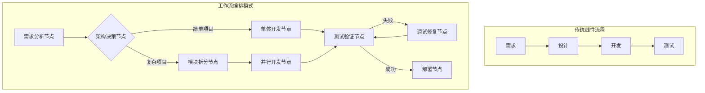
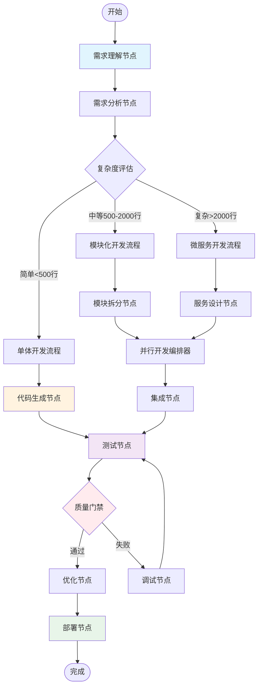

# AI编程教练指南 v2：工作流编排驱动的智能开发

> **版本**: v2.0
> **核心理念**: 将AI编程转化为可编排、可执行、可复用的工作流图谱
> **关键创新**: 从线性流程到动态图结构，实现真正的自动化AI协作开发

---

## 🎯 核心概念：从流程到图谱

### 什么是工作流编排的AI编程？

传统的AI编程是线性的：需求→设计→开发→测试。而**工作流编排**将这个过程转化为一个**有向图（Directed Graph）**，每个开发任务是图中的**节点（Node）**，任务之间的依赖和流转关系是**边（Edge）**。



### 核心术语解释

| 术语 | 定义 | AI编程中的含义 | 实际例子 |
|------|------|---------------|----------|
| **节点（Node）** | 工作流中的执行单元 | 一个独立的AI编程任务 | "生成API接口"、"编写测试用例" |
| **边（Edge）** | 节点间的连接 | 任务的执行顺序和依赖 | "设计完成后→开始编码" |
| **状态（State）** | 工作流中传递的数据 | 项目的所有信息和上下文 | 需求文档、代码、测试结果等 |
| **条件边（Conditional Edge）** | 根据条件选择路径 | 基于项目特征的智能决策 | "如果代码>1000行→启动模块化拆分" |
| **检查点（Checkpoint）** | 质量验证节点 | 确保代码质量的关卡 | 代码审查、测试覆盖率检查 |

---

## 🏗️ AI编程工作流架构

### 完整的工作流图谱



### 状态管理模型

```python
from typing import TypedDict, List, Dict, Optional
from enum import Enum

class ProjectPhase(Enum):
    """项目阶段枚举"""
    REQUIREMENT = "requirement"
    DESIGN = "design"
    DEVELOPMENT = "development"
    TESTING = "testing"
    DEPLOYMENT = "deployment"

class ProjectState(TypedDict):
    """项目状态：在整个工作流中传递的核心数据结构"""
    # 项目基础信息
    project_name: str
    project_type: str  # web/api/cli/library
    complexity: str     # simple/medium/complex

    # 需求相关
    requirements: Dict[str, str]
    user_stories: List[str]
    acceptance_criteria: List[str]

    # 架构相关
    architecture: Dict[str, any]
    modules: List[Dict[str, str]]
    interfaces: Dict[str, str]

    # 代码相关
    generated_code: Dict[str, str]  # 文件路径: 代码内容
    test_cases: List[Dict[str, any]]

    # 质量相关
    test_results: Dict[str, bool]
    coverage: float
    lint_errors: List[str]

    # 流程控制
    current_phase: ProjectPhase
    retry_count: int
    error_log: List[str]
    decisions: Dict[str, str]  # 记录所有决策点的选择
```

---

## 🔧 节点设计模式

### 1. 需求分析节点

```python
from typing import Dict, Any
from langgraph.graph import StateGraph

def requirement_analysis_node(state: ProjectState) -> ProjectState:
    """
    需求分析节点：理解和澄清项目需求

    职责：
    1. 解析用户输入的需求
    2. 生成详细的PRD文档
    3. 创建用户故事和验收标准
    4. 评估项目复杂度
    """
    # 使用AI分析需求
    prompt = f"""
    分析以下项目需求：
    {state['requirements']}

    请生成：
    1. 功能清单
    2. 非功能需求
    3. 技术约束
    4. 项目复杂度评估（simple/medium/complex）
    """

    # AI处理逻辑...
    analysis_result = ai_analyze(prompt)

    # 更新状态
    state['user_stories'] = analysis_result['user_stories']
    state['complexity'] = analysis_result['complexity']
    state['current_phase'] = ProjectPhase.DESIGN

    return state
```

### 2. 模块拆分节点

```python
def module_split_node(state: ProjectState) -> ProjectState:
    """
    模块拆分节点：将复杂项目分解为可管理的模块

    拆分策略：
    - 按功能边界拆分
    - 按数据流拆分
    - 按技术层次拆分
    """
    modules = []

    # 基于项目类型选择拆分策略
    if state['project_type'] == 'web':
        modules = split_by_mvc_pattern(state)
    elif state['project_type'] == 'api':
        modules = split_by_endpoints(state)
    else:
        modules = split_by_features(state)

    # 为每个模块生成接口定义
    for module in modules:
        module['interface'] = generate_interface(module)
        module['dependencies'] = analyze_dependencies(module)

    state['modules'] = modules
    return state

def split_by_mvc_pattern(state: ProjectState) -> List[Dict]:
    """MVC模式拆分"""
    return [
        {
            "name": "models",
            "type": "data_layer",
            "estimated_loc": 200,
            "description": "数据模型和数据库交互"
        },
        {
            "name": "views",
            "type": "presentation_layer",
            "estimated_loc": 300,
            "description": "用户界面和模板"
        },
        {
            "name": "controllers",
            "type": "business_layer",
            "estimated_loc": 400,
            "description": "业务逻辑处理"
        }
    ]
```

### 3. 并行开发编排器

```python
import asyncio
from concurrent.futures import ThreadPoolExecutor

class ParallelDevelopmentOrchestrator:
    """
    并行开发编排器：同时处理多个独立模块
    """

    def __init__(self, max_workers=3):
        self.executor = ThreadPoolExecutor(max_workers=max_workers)

    async def execute(self, state: ProjectState) -> ProjectState:
        """并行执行模块开发"""
        modules = state['modules']

        # 创建开发任务
        tasks = []
        for module in modules:
            if not self.has_unmet_dependencies(module, state):
                task = self.develop_module_async(module, state)
                tasks.append(task)

        # 并行执行
        results = await asyncio.gather(*tasks)

        # 合并结果
        for module_code in results:
            state['generated_code'].update(module_code)

        return state

    async def develop_module_async(self, module: Dict, state: ProjectState) -> Dict:
        """异步开发单个模块"""
        prompt = self.build_module_prompt(module, state)
        code = await self.generate_code_with_ai(prompt)
        return {module['name']: code}
```

### 4. 质量门禁节点

```python
class QualityGateNode:
    """
    质量门禁：自动化的代码质量检查
    """

    def __init__(self, thresholds: Dict[str, float]):
        self.thresholds = thresholds

    def execute(self, state: ProjectState) -> tuple[str, ProjectState]:
        """
        执行质量检查并返回决策

        返回: (决策, 更新后的状态)
        决策可能是: 'pass', 'minor_fix', 'major_fix'
        """
        checks = {
            'test_pass_rate': self.check_tests(state),
            'coverage': self.check_coverage(state),
            'lint_score': self.check_lint(state),
            'complexity': self.check_complexity(state)
        }

        # 评估总体质量
        if all(checks.values()):
            return 'pass', state
        elif checks['test_pass_rate'] and checks['coverage']:
            state['error_log'].append("Minor issues found")
            return 'minor_fix', state
        else:
            state['error_log'].append("Major issues found")
            return 'major_fix', state

    def check_coverage(self, state: ProjectState) -> bool:
        """检查测试覆盖率"""
        return state['coverage'] >= self.thresholds['min_coverage']
```

---

## 🎮 动态决策机制

### 条件路由策略

```python
def complexity_router(state: ProjectState) -> str:
    """
    复杂度路由器：根据项目复杂度选择开发策略

    这是一个条件边的决策函数，返回下一个节点的名称
    """
    complexity = state['complexity']
    loc_estimate = estimate_lines_of_code(state)

    # 动态调整复杂度判断
    if state.get('retry_count', 0) > 2:
        # 如果已经重试多次，降级到更简单的策略
        return 'simple_flow'

    if complexity == 'simple' or loc_estimate < 500:
        return 'simple_flow'
    elif complexity == 'medium' or loc_estimate < 2000:
        return 'modular_flow'
    else:
        return 'micro_service_flow'

def test_result_router(state: ProjectState) -> str:
    """
    测试结果路由器：根据测试结果决定下一步
    """
    test_pass_rate = calculate_pass_rate(state['test_results'])

    if test_pass_rate >= 0.95:
        return 'optimization_node'
    elif test_pass_rate >= 0.7:
        return 'minor_fix_node'
    else:
        return 'major_debug_node'
```

### 循环与重试机制

```python
import time
from typing import Callable

class RetryableNode:
    """
    可重试节点：支持自动重试和退避策略
    """

    def __init__(self, max_retries=3, backoff_factor=2):
        self.max_retries = max_retries
        self.backoff_factor = backoff_factor

    def execute_with_retry(self, state: ProjectState, node_func: Callable) -> ProjectState:
        """
        带重试机制的节点执行
        """
        retry_count = 0
        last_error = None

        while retry_count < self.max_retries:
            try:
                # 执行节点函数
                result = node_func(state)

                # 成功则重置重试计数
                state['retry_count'] = 0
                return result

            except Exception as e:
                retry_count += 1
                last_error = e

                # 记录错误
                state['error_log'].append(f"Retry {retry_count}: {str(e)}")

                # 指数退避
                if retry_count < self.max_retries:
                    wait_time = self.backoff_factor ** retry_count
                    time.sleep(wait_time)

                # 降级策略
                if retry_count == 2:
                    state = self.apply_fallback_strategy(state)

        # 超过最大重试次数
        raise Exception(f"Failed after {self.max_retries} retries: {last_error}")

    def apply_fallback_strategy(self, state: ProjectState) -> ProjectState:
        """应用降级策略"""
        state['complexity'] = 'simple'  # 降低复杂度
        state['decisions']['fallback_applied'] = 'yes'
        return state
```

---

## 📦 工作流模板库

### 1. Web应用开发工作流

```python
def create_web_app_workflow() -> StateGraph:
    """
    创建Web应用开发工作流

    适用场景：
    - 全栈Web应用
    - 包含前后端分离
    - 需要数据库设计
    """
    workflow = StateGraph(ProjectState)

    # 添加节点
    workflow.add_node("requirements", requirement_analysis_node)
    workflow.add_node("database_design", database_design_node)
    workflow.add_node("api_design", api_design_node)
    workflow.add_node("frontend_design", frontend_design_node)
    workflow.add_node("backend_dev", backend_development_node)
    workflow.add_node("frontend_dev", frontend_development_node)
    workflow.add_node("integration", integration_node)
    workflow.add_node("testing", testing_node)
    workflow.add_node("deployment", deployment_node)

    # 设置入口
    workflow.set_entry_point("requirements")

    # 添加边
    workflow.add_edge("requirements", "database_design")
    workflow.add_edge("database_design", "api_design")

    # 并行开发前后端
    workflow.add_edge("api_design", "backend_dev")
    workflow.add_edge("api_design", "frontend_design")
    workflow.add_edge("frontend_design", "frontend_dev")

    # 集成
    workflow.add_edge("backend_dev", "integration")
    workflow.add_edge("frontend_dev", "integration")

    # 测试和部署
    workflow.add_edge("integration", "testing")
    workflow.add_conditional_edges(
        "testing",
        test_result_router,
        {
            "optimization_node": "deployment",
            "major_debug_node": "debug"
        }
    )

    return workflow.compile()
```

### 2. API服务开发工作流

```python
def create_api_service_workflow() -> StateGraph:
    """
    API服务开发工作流

    特点：
    - 契约优先设计
    - 自动生成文档
    - Mock服务支持
    """
    workflow = StateGraph(ProjectState)

    # 契约设计优先
    workflow.add_node("openapi_design", openapi_design_node)
    workflow.add_node("mock_server", create_mock_server_node)
    workflow.add_node("implementation", api_implementation_node)
    workflow.add_node("contract_test", contract_testing_node)

    # 工作流编排
    workflow.set_entry_point("openapi_design")
    workflow.add_edge("openapi_design", "mock_server")
    workflow.add_edge("mock_server", "implementation")
    workflow.add_edge("implementation", "contract_test")

    return workflow.compile()

def openapi_design_node(state: ProjectState) -> ProjectState:
    """OpenAPI设计节点"""
    prompt = f"""
    基于需求设计OpenAPI规范：
    {state['requirements']}

    生成包含：
    1. 路径和方法定义
    2. 请求/响应模式
    3. 错误代码定义
    """

    api_spec = generate_openapi_spec(prompt)
    state['architecture']['api_spec'] = api_spec
    return state
```

### 3. 数据分析项目工作流

```python
def create_data_analysis_workflow() -> StateGraph:
    """
    数据分析项目工作流

    包含：
    - 数据获取和清洗
    - 探索性分析
    - 模型开发
    - 可视化
    """
    workflow = StateGraph(ProjectState)

    # 数据pipeline节点
    workflow.add_node("data_fetch", data_fetching_node)
    workflow.add_node("data_clean", data_cleaning_node)
    workflow.add_node("eda", exploratory_analysis_node)
    workflow.add_node("feature_eng", feature_engineering_node)
    workflow.add_node("modeling", model_development_node)
    workflow.add_node("visualization", visualization_node)
    workflow.add_node("report", report_generation_node)

    # 线性流程with条件分支
    workflow.set_entry_point("data_fetch")
    workflow.add_edge("data_fetch", "data_clean")
    workflow.add_edge("data_clean", "eda")

    # EDA后的条件分支
    workflow.add_conditional_edges(
        "eda",
        lambda s: "feature_eng" if s.get('needs_features', False) else "visualization",
        {
            "feature_eng": "feature_eng",
            "visualization": "visualization"
        }
    )

    workflow.add_edge("feature_eng", "modeling")
    workflow.add_edge("modeling", "visualization")
    workflow.add_edge("visualization", "report")

    return workflow.compile()
```

---

## 🚀 实战应用

### 完整示例：构建任务管理系统

```python
import asyncio
from typing import Dict, Any
from langgraph.graph import StateGraph

class TaskManagementSystemBuilder:
    """
    任务管理系统构建器
    演示如何使用工作流编排来开发完整项目
    """

    def __init__(self):
        self.workflow = self.create_workflow()

    def create_workflow(self) -> StateGraph:
        """创建开发工作流"""
        builder = StateGraph(ProjectState)

        # 需求和设计阶段
        builder.add_node("gather_requirements", self.gather_requirements)
        builder.add_node("design_database", self.design_database_schema)
        builder.add_node("design_api", self.design_rest_api)

        # 开发阶段
        builder.add_node("develop_backend", self.develop_backend)
        builder.add_node("develop_frontend", self.develop_frontend)
        builder.add_node("develop_tests", self.develop_test_suite)

        # 质量保证阶段
        builder.add_node("run_tests", self.run_automated_tests)
        builder.add_node("code_review", self.perform_code_review)
        builder.add_node("optimize", self.optimize_performance)

        # 部署阶段
        builder.add_node("containerize", self.create_docker_config)
        builder.add_node("deploy", self.deploy_to_cloud)

        # 设置流程
        builder.set_entry_point("gather_requirements")

        # 串行流程：需求→数据库设计→API设计
        builder.add_edge("gather_requirements", "design_database")
        builder.add_edge("design_database", "design_api")

        # 并行开发
        builder.add_edge("design_api", "develop_backend")
        builder.add_edge("design_api", "develop_frontend")
        builder.add_edge("design_api", "develop_tests")

        # 汇聚到测试
        builder.add_edge("develop_backend", "run_tests")
        builder.add_edge("develop_frontend", "run_tests")
        builder.add_edge("develop_tests", "run_tests")

        # 质量检查流程
        builder.add_conditional_edges(
            "run_tests",
            self.check_test_results,
            {
                "pass": "code_review",
                "fail": "fix_issues"
            }
        )

        builder.add_edge("code_review", "optimize")
        builder.add_edge("optimize", "containerize")
        builder.add_edge("containerize", "deploy")

        return builder.compile()

    def gather_requirements(self, state: ProjectState) -> ProjectState:
        """需求收集节点"""
        prompt = """
        创建一个任务管理系统的需求文档，包括：
        1. 用户故事（至少5个）
        2. 功能需求
        3. 非功能需求
        4. 技术栈建议
        """

        requirements = self.generate_with_ai(prompt)
        state['requirements'] = requirements
        state['user_stories'] = self.extract_user_stories(requirements)
        return state

    def design_database_schema(self, state: ProjectState) -> ProjectState:
        """数据库设计节点"""
        prompt = f"""
        基于以下需求设计数据库schema：
        {state['requirements']}

        使用PostgreSQL，创建：
        1. 表结构定义
        2. 索引设计
        3. 关系约束
        """

        schema = self.generate_with_ai(prompt)
        state['architecture']['database'] = schema
        return state

    def develop_backend(self, state: ProjectState) -> ProjectState:
        """后端开发节点"""
        # 基于API设计生成后端代码
        api_spec = state['architecture']['api']

        # 生成各个组件
        models = self.generate_models(api_spec)
        controllers = self.generate_controllers(api_spec)
        services = self.generate_services(api_spec)

        state['generated_code'].update({
            'models.py': models,
            'controllers.py': controllers,
            'services.py': services
        })

        return state

    def check_test_results(self, state: ProjectState) -> str:
        """检查测试结果并决定下一步"""
        test_results = state.get('test_results', {})
        if not test_results:
            return "fail"

        pass_count = sum(1 for result in test_results.values() if result)
        total_count = len(test_results)
        pass_rate = pass_count / total_count if total_count > 0 else 0

        if pass_rate >= 0.95:
            return "pass"
        else:
            state['error_log'].append(f"Test pass rate: {pass_rate:.2%}")
            return "fail"

    def generate_with_ai(self, prompt: str) -> str:
        """使用AI生成内容的占位函数"""
        # 这里应该集成实际的AI服务
        return f"AI generated content for: {prompt[:50]}..."

    async def execute(self, initial_requirements: str):
        """执行完整的开发工作流"""
        # 初始化状态
        initial_state = {
            "project_name": "Task Management System",
            "project_type": "web",
            "complexity": "medium",
            "requirements": {"description": initial_requirements},
            "user_stories": [],
            "acceptance_criteria": [],
            "architecture": {},
            "modules": [],
            "interfaces": {},
            "generated_code": {},
            "test_cases": [],
            "test_results": {},
            "coverage": 0.0,
            "lint_errors": [],
            "current_phase": ProjectPhase.REQUIREMENT,
            "retry_count": 0,
            "error_log": [],
            "decisions": {}
        }

        # 运行工作流
        final_state = self.workflow.invoke(initial_state)

        # 输出结果
        print("项目开发完成！")
        print(f"生成了 {len(final_state['generated_code'])} 个文件")
        print(f"测试覆盖率: {final_state['coverage']:.2%}")

        return final_state

# 使用示例
async def main():
    builder = TaskManagementSystemBuilder()

    requirements = """
    创建一个现代的任务管理系统，支持：
    - 用户注册和认证
    - 创建、编辑、删除任务
    - 任务分类和标签
    - 团队协作功能
    - 实时通知
    """

    result = await builder.execute(requirements)

    # 保存生成的代码
    import os
    os.makedirs("output", exist_ok=True)
    for filename, code in result['generated_code'].items():
        with open(f"output/{filename}", "w") as f:
            f.write(code)

if __name__ == "__main__":
    asyncio.run(main())
```

---

## ⚙️ Token优化策略（工作流版）

### 智能上下文管理器

```python
class WorkflowContextManager:
    """
    工作流上下文管理器：优化Token使用
    """

    def __init__(self, max_context_size=4000):
        self.max_context_size = max_context_size
        self.context_cache = {}

    def prepare_context(self, state: ProjectState, node_name: str) -> str:
        """
        为特定节点准备精简的上下文

        策略：
        1. 只包含当前节点需要的信息
        2. 使用引用而非完整内容
        3. 压缩历史信息
        """
        essential_context = {
            "requirement_analysis": ["requirements", "user_stories"],
            "module_development": ["current_module", "interfaces", "dependencies"],
            "testing": ["generated_code", "test_cases"],
            "debugging": ["error_log", "test_results", "relevant_code"]
        }

        # 获取节点类型
        node_type = self.get_node_type(node_name)

        # 只提取必要的状态字段
        context = {}
        for field in essential_context.get(node_type, []):
            if field in state:
                context[field] = self.compress_if_needed(state[field])

        return self.format_context(context)

    def compress_if_needed(self, data) -> any:
        """压缩大型数据"""
        if isinstance(data, str) and len(data) > 1000:
            # 使用摘要替代完整内容
            return self.create_summary(data)
        elif isinstance(data, list) and len(data) > 10:
            # 只保留最相关的项目
            return data[:5] + ["..."] + data[-3:]
        return data

    def get_node_type(self, node_name: str) -> str:
        """根据节点名称推断节点类型"""
        if "requirement" in node_name.lower():
            return "requirement_analysis"
        elif "develop" in node_name.lower():
            return "module_development"
        elif "test" in node_name.lower():
            return "testing"
        elif "debug" in node_name.lower():
            return "debugging"
        return "general"

    def create_summary(self, text: str) -> str:
        """创建文本摘要"""
        # 简单的摘要策略：取前200字符 + 关键信息
        lines = text.split('\n')
        key_lines = [line for line in lines[:10] if len(line.strip()) > 0]
        return '\n'.join(key_lines[:5]) + "\n... [truncated]"

    def format_context(self, context: Dict) -> str:
        """格式化上下文为字符串"""
        formatted = []
        for key, value in context.items():
            if isinstance(value, str):
                formatted.append(f"{key}: {value}")
            elif isinstance(value, (list, dict)):
                formatted.append(f"{key}: {str(value)[:200]}...")
        return '\n'.join(formatted)
```

### 增量式开发策略

```python
class IncrementalDevelopmentStrategy:
    """
    增量式开发策略：减少单次Token消耗
    """

    def split_large_module(self, module: Dict) -> List[Dict]:
        """将大模块拆分为多个小任务"""
        if module.get('estimated_loc', 0) > 500:
            # 按功能拆分
            sub_modules = []
            functions = self.identify_functions(module)

            for func_group in self.group_functions(functions, max_size=100):
                sub_modules.append({
                    "name": f"{module['name']}_{func_group['name']}",
                    "functions": func_group['functions'],
                    "estimated_loc": func_group['loc']
                })

            return sub_modules
        return [module]

    def identify_functions(self, module: Dict) -> List[Dict]:
        """识别模块中的函数"""
        # 这里应该分析模块描述，提取函数列表
        description = module.get('description', '')
        # 简化版本：基于关键词提取
        functions = []
        if 'user' in description.lower():
            functions.append({"name": "user_management", "loc": 50})
        if 'data' in description.lower():
            functions.append({"name": "data_handling", "loc": 80})
        if 'api' in description.lower():
            functions.append({"name": "api_endpoints", "loc": 70})
        return functions

    def group_functions(self, functions: List[Dict], max_size: int) -> List[Dict]:
        """将函数分组"""
        groups = []
        current_group = {"name": "group_1", "functions": [], "loc": 0}
        group_index = 1

        for func in functions:
            if current_group["loc"] + func["loc"] > max_size:
                if current_group["functions"]:
                    groups.append(current_group)
                group_index += 1
                current_group = {
                    "name": f"group_{group_index}",
                    "functions": [func],
                    "loc": func["loc"]
                }
            else:
                current_group["functions"].append(func)
                current_group["loc"] += func["loc"]

        if current_group["functions"]:
            groups.append(current_group)

        return groups

    def iterative_refinement(self, state: ProjectState) -> ProjectState:
        """迭代式改进：逐步完善代码"""
        iterations = [
            ("skeleton", "生成基础框架"),
            ("implementation", "实现核心逻辑"),
            ("error_handling", "添加错误处理"),
            ("optimization", "优化性能"),
            ("documentation", "添加文档")
        ]

        for phase, description in iterations:
            state = self.refine_code(state, phase)
            # 每次迭代后清理不需要的上下文
            state = self.cleanup_context(state, phase)

        return state

    def refine_code(self, state: ProjectState, phase: str) -> ProjectState:
        """改进代码的特定阶段"""
        # 这里应该根据阶段调用相应的AI处理
        print(f"Refining code for phase: {phase}")
        return state

    def cleanup_context(self, state: ProjectState, completed_phase: str) -> ProjectState:
        """清理不需要的上下文信息"""
        # 移除已完成阶段的临时数据
        if completed_phase in state.get('temp_data', {}):
            del state['temp_data'][completed_phase]
        return state
```

---

## 🎯 最佳实践总结

### 工作流设计原则

1. **单一职责**：每个节点只做一件事
   ```python
   # ✅ 好的设计
   def validate_requirements(state): pass
   def analyze_complexity(state): pass

   # ❌ 不好的设计
   def validate_and_analyze_everything(state): pass
   ```

2. **幂等性**：节点可以安全地重试
   ```python
   def idempotent_node(state: ProjectState) -> ProjectState:
       # 检查是否已经执行过
       if state.get('node_completed', False):
           return state

       # 执行实际工作
       result = do_work(state)

       # 标记完成
       result['node_completed'] = True
       return result
   ```

3. **可观测性**：记录每个节点的输入输出
   ```python
   def observable_node(state: ProjectState) -> ProjectState:
       # 记录输入
       input_snapshot = state.copy()

       # 执行工作
       result = process(state)

       # 记录变更
       changes = get_state_diff(input_snapshot, result)
       result['execution_log'].append({
           'node': 'observable_node',
           'changes': changes,
           'timestamp': datetime.now()
       })

       return result
   ```

4. **渐进式复杂度**：从简单工作流开始，逐步增加复杂性

### 状态管理最佳实践

1. **最小化状态**：只传递必要的信息
2. **版本化状态**：支持状态回滚
3. **状态验证**：每个节点验证输入状态
4. **状态持久化**：关键节点后保存状态快照

### 错误处理策略

1. **优雅降级**：复杂策略失败时退回到简单策略
2. **自动重试**：瞬时错误自动重试
3. **人工介入点**：关键决策保留人工确认
4. **错误传播**：错误信息在状态中向下传递

---

## 🚀 快速开始模板

```python
# quick_start.py
from langgraph.graph import StateGraph
from typing import Dict, Any, TypedDict, List

class MyProjectState(TypedDict):
    """项目状态定义"""
    requirements: str
    code: Dict[str, str]
    tests: List[str]
    status: str

def create_your_workflow():
    """创建你的第一个AI编程工作流"""

    # 2. 创建节点函数
    def analyze_requirements(state: MyProjectState) -> MyProjectState:
        """需求分析节点"""
        print(f"分析需求: {state['requirements']}")
        # 你的需求分析逻辑
        state['status'] = 'requirements_analyzed'
        return state

    def generate_code(state: MyProjectState) -> MyProjectState:
        """代码生成节点"""
        print("生成代码中...")
        # 你的代码生成逻辑
        state['code'] = {
            "main.py": "# Generated code\nprint('Hello World')",
            "utils.py": "# Utility functions"
        }
        state['status'] = 'code_generated'
        return state

    def write_tests(state: MyProjectState) -> MyProjectState:
        """测试生成节点"""
        print("编写测试中...")
        # 你的测试生成逻辑
        state['tests'] = ["test_main.py", "test_utils.py"]
        state['status'] = 'tests_written'
        return state

    # 3. 构建工作流
    workflow = StateGraph(MyProjectState)

    # 添加节点
    workflow.add_node("analyze", analyze_requirements)
    workflow.add_node("code", generate_code)
    workflow.add_node("test", write_tests)

    # 设置流程
    workflow.set_entry_point("analyze")
    workflow.add_edge("analyze", "code")
    workflow.add_edge("code", "test")

    # 4. 编译并返回
    return workflow.compile()

# 使用示例
def main():
    """主函数"""
    # 创建工作流
    workflow = create_your_workflow()

    # 初始状态
    initial_state = {
        "requirements": "创建一个简单的计算器",
        "code": {},
        "tests": [],
        "status": "started"
    }

    # 执行工作流
    result = workflow.invoke(initial_state)

    # 显示结果
    print(f"\n🎉 工作流执行完成!")
    print(f"最终状态: {result['status']}")
    print(f"生成的文件: {list(result['code'].keys())}")
    print(f"测试文件: {result['tests']}")

if __name__ == "__main__":
    main()
```

---

## 📚 进阶学习路径

```mermaid
roadmap
    title AI编程工作流进阶路径

    section 入门阶段
        理解工作流概念 : 5: Me
        创建简单线性工作流
        使用基础节点和边

    section 进阶阶段
        掌握条件分支
        实现并行处理
        设计复杂状态管理

    section 高级阶段
        构建可复用节点库
        实现自适应工作流
        集成外部服务

    section 专家阶段
        设计领域特定工作流语言
        实现工作流优化器
        构建工作流生态系统
```

### 学习建议

1. **从简单开始**：先创建3-5个节点的简单工作流
2. **逐步增加复杂性**：添加条件分支、并行处理
3. **积累节点库**：将常用的开发任务封装为可复用节点
4. **实战应用**：在真实项目中使用和改进工作流
5. **分享交流**：与其他开发者分享你的工作流模板

---

## 🎓 总结

工作流编排的AI编程代表了软件开发的新范式。通过将开发过程转化为可执行的图结构，我们实现了：

1. **自动化程度的飞跃**：从手动协调到自动编排
2. **质量的内建保证**：质量检查成为工作流的一部分
3. **可复用性的提升**：节点和工作流模板可以跨项目复用
4. **透明度的增强**：整个开发过程可视化、可追踪

### 关键优势

- **🔄 可重复性**：标准化的开发流程
- **🎯 可预测性**：明确的质量门禁和检查点
- **⚡ 高效率**：并行处理和智能决策
- **🛡️ 高质量**：内建的测试和验证机制
- **📈 可扩展性**：模块化的节点设计

记住：**工作流编排不是要取代开发者，而是要增强开发者的能力，让我们能够专注于创造性的工作，而将重复性任务交给自动化流程。**

---

**下一步行动**：
1. 选择一个简单项目，尝试创建你的第一个工作流
2. 逐步增加节点和复杂度
3. 构建你自己的节点库
4. 分享你的工作流模板，贡献给社区

祝你在AI编程工作流的道路上不断进步！🚀

---

**文档信息**
- 创建日期：2025-09-21
- 版本：v2.0
- 作者：Claude AI Programming Coach
- 许可：MIT License