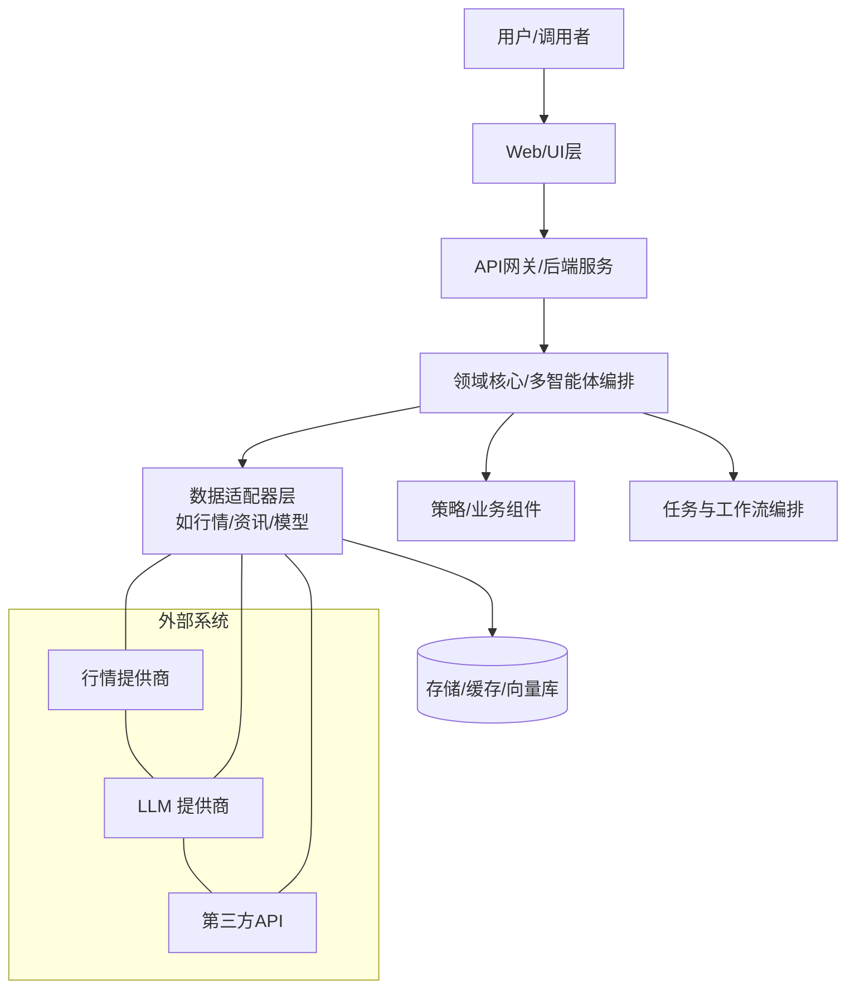
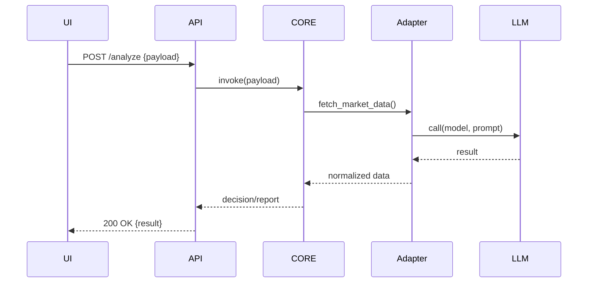
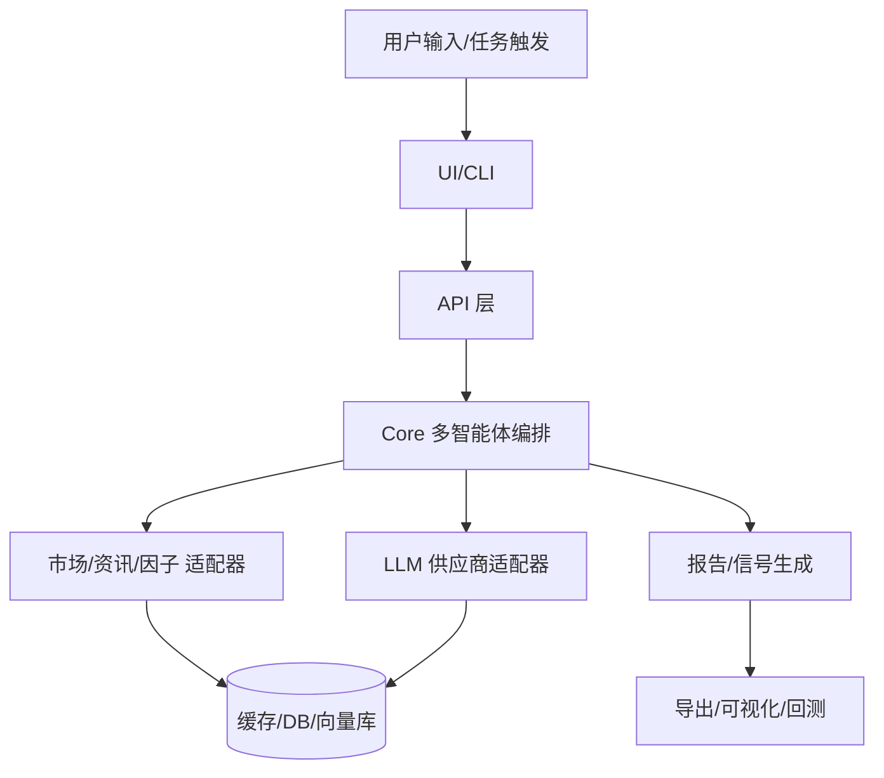

# AI 编程教练 · 从 0 到 1 的工程化实践指南
*版本：2025-09-21 12:00 UTC*

> 你将作为“产品经理 + 架构师 + 代码工”的**一人三角**，高效指挥 AI 工具完成中大型项目。本文给出：最佳实践流程（含 mermaid 图），模块化拆分方法，集成与 Token 管理策略，以及以 `TradingAgent_CN_update` 为例的**可落地工作流 + Prompt 套件**（可直接粘到 `claude.md` 使用）。

---

## 目录
- [A. 中大型 AI 编程项目最佳实践流程（Mermaid）](#a-中大型-ai-编程项目最佳实践流程mermaid)
- [B. 初学者如何“控盘”架构：从全局到模块（含模板）](#b-初学者如何控盘架构从全局到模块含模板)
- [C. 模块完成后如何高效集成？如何省 Token？](#c-模块完成后如何高效集成如何省-token)
- [D. 以 TradingAgent_CN_update 为例的工作流与 Prompt](#d-以-tradingagent_cn_update-为例的工作流与-prompt)
- [E. 调试与上线：一把梭到可运行](#e-调试与上线一把梭到可运行)
- [F. 附：可直接粘贴的 claude.md（项目级）与 ~/.claude/claude.md（全局级）样例](#f-附可直接粘贴的-claudemd项目级-与-claudeclaudemd全局级样例)
- [G. 清单与自测](#g-清单与自测)

---

## A. 中大型 AI 编程项目最佳实践流程（Mermaid）

```mermaid
flowchart LR
  A[需求收集<br/>Use Cases/痛点/目标] --> B[澄清与约束<br/>范围/边界/非功能需求]
  B --> C[建立共享工件<br/>/docs/vision.md<br/>/docs/arch.md<br/>/docs/contracts/*.md<br/>/todo.md]
  C --> D[代码库读档与盘点<br/>依赖/入口/目录/脚手架]
  D --> E[架构分层与模块切片<br/>Hex/Clean/C4-lite]
  E --> F[任务化拆解<br/>Task Cards + 接口契约 + 验收准则]
  F --> G[AI 辅助实现单模块<br/>最小可运行 + 单测]
  G --> H[集成/契约校验<br/>接口/事件/数据流打通]
  H --> I[端到端用例测试<br/>冒烟/回归/基准数据]
  I --> J[CI/CD 持续集成/部署<br/>预生产/生产]
  J --> K[运行观测与反馈<br/>日志/指标/用户反馈]
  K --> L[迭代：需求、架构、任务清单闭环]

  style C fill:#f5f5f5,stroke:#999,stroke-width:1px
  style F fill:#f5f5f5,stroke:#999,stroke-width:1px
  style I fill:#f5f5f5,stroke:#999,stroke-width:1px
```



> 核心理念：**文档是 AI 的记忆体**，**契约是模块的真相**，**最小闭环**优先。

---

## B. 初学者如何“控盘”架构：从全局到模块（含模板）

### B1. C4-lite 视角（系统→容器→组件）


### B2. 如何把“大项目”切成“AI 可单独完成的小模块”
- 按**边界上下文**切：UI、API、Core（编排/策略）、Adapters（数据/模型）、Infra（配置/日志/观测）。
- 每个模块都先产出**三件套**：
  1) `contracts/*.md`（接口/输入输出/错误码/验收标准）；  
  2) `skeleton/`（目录与空类/函数/占位测试）；  
  3) `fixture/`（样例输入/黄金输出）。
- **先契约后实现**：AI 按契约对齐后再生成代码。

#### 模块契约模板（粘贴即用）
```md
# contracts/<module>.md
## Why （该模块存在的原因/业务价值）
## What （功能边界/不做什么）
## API/CLI/事件 契约
- 输入：schema + 样例
- 输出：schema + 样例
- 错误：枚举 + 处理策略
## 依赖与外部交互
- 上游/下游、第三方服务、鉴权
## 验收标准（必须可自动化）
- [ ] 用例1：...
- [ ] 用例2：...
```

#### 任务卡模板（Task Card）
```md
# tasks/<module>-<feature>.md
## 目标
## 背景链接
- contracts/<module>.md
## 完成定义(DoD)
- [ ] 通过单测 N% 覆盖
- [ ] 通过契约验收用例
- [ ] 生成模块摘要 <module>_summary.md
## 交付物
- patch diff / PR 链接 / 测试报告
```

---

## C. 模块完成后如何高效集成？如何省 Token？

### C1. 集成“三板斧”
1. **契约校验**：用 JSON Schema / Pydantic / TypeScript 类型做**编译期/运行期**校验。  
2. **冒烟剧本**：编写 `smoke/` 中的脚本一键串起 UI→API→Core→Adapter。  
3. **端到端黄金用例**：为关键路径准备固定输入/输出，回归时一键比对。



### C2. Token 节流与上下文管理
- **工作集（Working Set）**：只把**当前模块 + 契约 + 摘要**喂给 AI。历史大文件只提供**链接/摘要**。  
- **渐进摘要**：每完成模块生成 `*_summary.md`，集成时只加载摘要而非全量代码。  
- **对话格式**（提示 AI 只产出 patch）：
  - 输入：`问题背景 + 当前文件清单 + 契约 + 期望变更`  
  - 输出：`统一 diff（udiff） + 新文件内容 + 测试结果`  
- **文件/片段引用标记**：用 `<<<path:line_start-line_end>>>` 引用必要片段，避免整文件塞上下文。

---

## D. 以 TradingAgent_CN_update 为例的工作流与 Prompt

> 背景：TradingAgents/TradingAgents 与其中文增强版属于**多智能体交易决策框架**，涉及数据适配、策略评估、代理协作与报告生成等典型模块化结构，可作为你项目拆分参考（示例参考仓库：TauricResearch/TradingAgents；中文增强版：hsliuping/TradingAgents-CN）。

### D1. 推荐的项目分层（可映射你的仓库目录）
```
/docs
  arch.md            # 全局架构/数据流/依赖图
  usecases.md        # 用户故事与端到端场景
  contracts/         # 各模块契约(输入/输出/错误/用例)
/src
  ui/                # Web 或 CLI
  api/               # FastAPI/Flask/Streamlit后端接口
  core/              # 多智能体编排/策略/评估
  adapters/          # 数据源(Finnhub/Tushare/..)、LLM供应商
  infra/             # 配置/日志/缓存/持久化/观测
/tests
  unit/  e2e/  smoke/
fixtures/            # 黄金用例输入输出
tools/               # 脚本、CI辅助
```

### D2. 典型数据与开发流（Mermaid）


### D3. “一模块一窗口”的具体落地
以“**Finnhub 适配器**”为例：
1. 新建 `contracts/adapters_finnhub.md`（定义输入/输出/错误/速率限制/重试策略/验收用例）。  
2. 生成 `src/adapters/finnhub/` 脚手架（含接口类、实现、异常、单测、fixtures）。  
3. AI 只加载：契约 + 脚手架 + 示例数据 → 产出实现与单测。  
4. `smoke/test_finnhub.sh` 调用 API，核对黄金输出；通过后合入主干。

### D4. Claude 工作流 Prompt（可贴到任务卡）
```md
# /tasks/adapter-finnhub.md → 给 Claude 的开发提示
你现在扮演资深后端工程师。请严格遵循 *contracts/adapters_finnhub.md*。
目标：实现 Finnhub 适配器的最小可运行版本并通过单测。

【上下文】
- 仅读取以下文件片段：
<<<contracts/adapters_finnhub.md:1-200>>>
<<<src/adapters/finnhub/__init__.py:1-200>>>
<<<src/adapters/finnhub/client.py:1-200>>>(若不存在请创建)
<<<tests/unit/test_finnhub.py:1-200>>>(若不存在请创建)

【输出要求】
1) 仅返回统一 diff（udiff）补丁；
2) 对新增文件给出完整文件内容；
3) 附上pytest的本地运行命令与期望通过的测试列表；
4) 不要解释性长文。

【约束】
- 异常必须有类型（如 RateLimitError / AuthError / DataError）；
- 所有外部请求封装在 client 层，便于打桩；
- 单测使用 fixtures/ 中样例；
- 日志与重试策略按契约执行。

【完成定义DoD】
- [ ] pytest 全绿；
- [ ] 通过 contracts 中所有验收用例；
- [ ] 生成 src/adapters/finnhub/_summary.md。
```

### D5. 集成与端到端验证 Prompt（例）
```md
# /tasks/e2e-smoke.md → 给 Claude 的测试与集成提示
目标：串联 UI→API→Core→Adapters 的最小端到端用例。

【上下文】
- 用例输入: fixtures/e2e/input_min.json
- 黄金输出: fixtures/e2e/output_min.json
- 冒烟脚本: smoke/run_min.sh

【输出要求】
1) 生成/修复冒烟脚本与必要配置；
2) 返回运行指令与期望日志关键字；
3) 若失败，返回定位步骤(二分法)与可复现最小命令；
4) 仅返回命令/脚本/diff。

【完成定义】
- [ ] 一条命令完成端到端；
- [ ] 输出与黄金用例吻合；
- [ ] 生成 e2e/ 报告。
```

> 提示：你也可以把“多智能体协作与策略评估”当作**独立模块**，同样用契约/fixtures/单测驱动。

---

## E. 调试与上线：一把梭到可运行

### E1. 本地“红线”
- `make setup && make test && make lint` 必须全绿再提交 PR。  
- 常用工具：`ruff`（lint）、`black`（格式化）、`mypy`（类型）、`pytest`（测试）、`pre-commit`（钩子）。

### E2. CI/CD（GitHub Actions 样例）
```yaml
# .github/workflows/ci.yml
name: CI
on: [push, pull_request]
jobs:
  build:
    runs-on: ubuntu-latest
    steps:
      - uses: actions/checkout@v4
      - uses: actions/setup-python@v5
        with: {{python-version: '3.11'}}
      - run: pip install -r requirements.txt
      - run: pip install -r requirements-dev.txt
      - run: ruff check .
      - run: black --check .
      - run: mypy .
      - run: pytest -q --maxfail=1 --disable-warnings
```

### E3. 部署最低可行路径
- Web：Streamlit/FastAPI + Dockerfile + `docker-compose.yml`；  
- 配置：全部走环境变量 + `.env.example`；  
- 机密：本地开发用 `.env`，云端改用 Secrets。

---

## F. 附：可直接粘贴的 claude.md（项目级）与 ~/.claude/claude.md（全局级）样例

### F1. 项目根目录：`claude.md`
```md
# 项目规则（项目级）
## 角色
- 你是资深“架构师+全栈工程师+测试负责人”。

## 工作方式
- 优先阅读 docs/contracts 与 *_summary.md；
- 仅在必要时读取文件片段，禁止整仓库铺开；
- 默认输出统一 diff（udiff）补丁 + 新文件全量内容；
- 若需澄清，每轮仅提出 **1 个**最关键问题；

## 产出规范
- 对每个模块：代码 + 单测 + 摘要文件 <module>_summary.md；
- 所有外部 API 都有适配器与错误类型；
- 对端到端路径，提供 smoke/ 脚本与 e2e 用例；

## 命令别名（示例）
- 计划：读取 /todo.md，补齐任务卡模板与依赖图；
- 开发：根据 /tasks/*.md 执行模块开发；
- 集成：执行 /tasks/e2e-smoke.md；

## 质量门槛（DoD）
- ruff/black/mypy/pytest 全绿；
- 合并前必须通过契约用例；
```

### F2. 全局默认：`~/.claude/claude.md`
```md
# 全局默认规则（个人）
- 输出尽量为可直接执行的命令/脚本/patch；
- 严格 Token 预算：仅加载当前任务所需文件/摘要；
- 当出现外部依赖/环境错误时，先输出最小复现命令；
- 默认不生成长篇注释，优先生成可执行工件。
```

---

## G. 清单与自测

- [ ] 我是否先写了 `docs/arch.md`、`contracts/*.md`、`todo.md`？  
- [ ] 每个模块是否都有 **契约/脚手架/fixtures/单测/摘要**？  
- [ ] 集成是否有 **smoke 脚本 + 黄金用例**？  
- [ ] CI 是否执行 **lint + 类型 + 单测**？  
- [ ] Secrets/配置是否全部走环境变量？  
- [ ] 是否采用 **工作集 + 摘要** 控制 Token？

---

### 附注（参考资料）
- 多智能体交易框架（结构拆分参考）：TauricResearch/TradingAgents；中文增强版：hsliuping/TradingAgents-CN。
