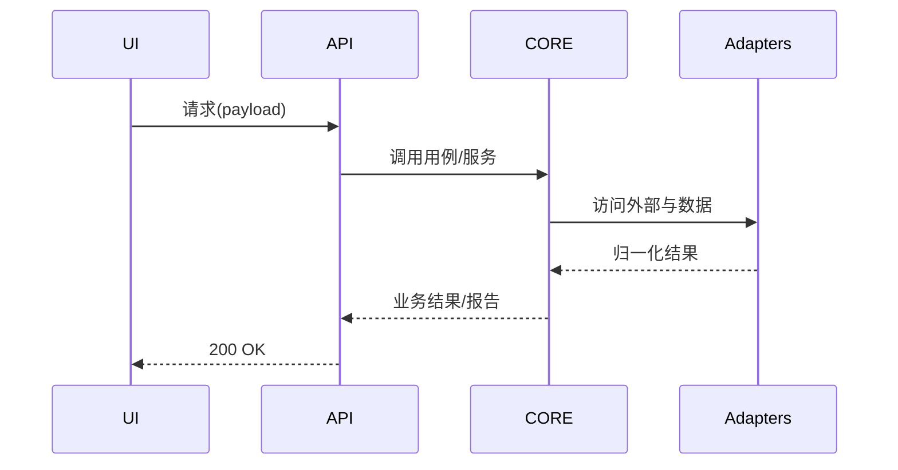

# 通用 Claude AI 编程工作流与原则（浓缩版）
*版本：2025-09-21 12:06 UTC*

> 聚焦两件事：**(2) 新人如何不依赖全栈知识也能控盘架构与科学拆解**；**(3) 模块完成后如何高效集成并节省 Token**。可直接粘到 `claude.md` 或作为团队工作流基线。

---

## 0. 三步快用（给新人）
1) **画全局图**（C4-lite）：系统→容器→组件，写清输入/输出/依赖与非功能约束。  
2) **契约先行**：对每个模块先写 `contracts/<module>.md`（接口、Schema、错误码、验收用例）+ 简易脚手架 + fixtures。  
3) **一模块一会话**：只把当前模块的**契约+脚手架+样例片段**喂给 Claude，要求**仅输出补丁/文件**与**单测**。

---

## 1. 总体工作流（Mermaid）

**原则**：文档是 AI 的“外置记忆体”，**契约 > 代码**，**最小闭环**优先。

---

## 2. 不懂全栈也能控盘：架构与科学拆解（重点）
### 2.1 C4-lite 清单（技术栈无关）
- **上下文/系统图**：谁调用我？我调用谁？数据从哪来往哪去？
- **容器层**（服务/应用）：UI、API、Core、Adapters、Infra（配置/日志/缓存/持久化/观测）。
- **组件层**：每个容器内部的关键组件/边界与数据流。

### 2.2 模块拆分“三件套”模板
```md
# contracts/<module>.md
## Why（价值/场景）
## What（做什么/不做什么）
## API 契约
- 输入/输出：JSON Schema + 示例
- 错误：类型枚举 + 处理策略
## 依赖
- 上/下游、第三方 API、鉴权/限流/重试
## 验收（必须可自动化）
- [ ] 用例1…  [ ] 用例2…
```

```md
# tasks/<module>-<feature>.md
## 目标
## 关联
- contracts/<module>.md
## 完成定义(DoD)
- [ ] 单测通过/覆盖线
- [ ] 契约用例通过
- [ ] 产出 <module>_summary.md
```

```txt
src/<module>/        # 脚手架（空类/空函数/占位测试）
fixtures/<module>/   # 样例输入/黄金输出
```

### 2.3 Claude「单模块开发」Prompt 核心范式
- **上下文**：仅提供`契约 + 脚手架 + 必要片段`，用片段引用：`<<<path:start-end>>>`。  
- **输出**：只要**统一 diff（udiff）**与**新增文件完整内容** + **pytest 命令**。  
- **约束**：异常要有类型；外部请求放 `client` 层；使用 fixtures；遵守重试/限流；产出 `_summary.md`。

**可复制示例**
```md
你是资深工程师。严格按 contracts/<module>.md 实现最小可运行版本并通过单测。
【上下文片段】
<<<contracts/<module>.md:1-200>>>
<<<src/<module>/__init__.py:1-200>>>
<<<tests/unit/test_<module>.py:1-200>>>(若无请创建)
【只输出】udiff 补丁 + 新文件全文 + 本地 pytest 命令列表。
【约束】错误类型化、client 封装 IO、用 fixtures、生成 src/<module>/_summary.md。
```

---

## 3. 多模块集成与 Token 高效利用（重点）
### 3.1 集成“三板斧”
1. **契约校验**：JSON Schema / Pydantic / TypeScript 类型在编译期/运行期双重校验。  
2. **冒烟剧本**：`smoke/run_min.sh` 串起 **UI→API→Core→Adapters** 最小链路，一条命令可复现。  
3. **E2E 黄金用例**：固定输入输出比对，回归时一键验证。



### 3.2 Token 预算与上下文打包（七条）
1. **工作集**：只加载「当前任务」相关文件与摘要。  
2. **渐进摘要**：每个模块完成产出 `<module>_summary.md`，集成时优先用摘要。  
3. **片段引用**：`<<<path:line1-line2>>>`，避免整文件导入。  
4. **只要补丁**：要求 Claude 输出 **udiff + 新文件内容**，拒绝大段解释。  
5. **外链索引**：长文档只给索引与锚点，不给全文。  
6. **分层会话**：单模块/集成/发布分别建会话，避免上下文污染。  
7. **失败二分法**：最小命令复现 + 二分定位，减少反复长对话。

### 3.3 Claude「集成与排错」Prompt 核心范式
```md
目标：打通 UI→API→Core→Adapters 的最小端到端用例。
【上下文】
- 冒烟脚本: smoke/run_min.sh
- 输入: fixtures/e2e/input_min.json
- 黄金输出: fixtures/e2e/output_min.json
【输出】
1) 修复或生成必要脚本/配置（仅给 diff/文件）；
2) 给出一条命令跑通；
3) 若失败，返回二分定位步骤与最小复现命令。
```

### 3.4 最小模板（可放仓库）
```bash
# smoke/run_min.sh
set -euo pipefail
python -m pytest -q tests/unit
python tools/wait_services.py
python scripts/e2e_min.py --in fixtures/e2e/input_min.json --out /tmp/e2e_out.json
python tools/diff_json.py fixtures/e2e/output_min.json /tmp/e2e_out.json
echo "SMOKE OK"
```

```yaml
# .github/workflows/ci.yml（片段）
- run: ruff check . && black --check . && mypy .
- run: pytest -q --maxfail=1 --disable-warnings
- run: bash smoke/run_min.sh
```

---

## 4. DoD（完成定义）清单
- [ ] `docs/arch.md`、`contracts/*`、`todo.md` 已建立并更新。  
- [ ] 每个模块：契约/脚手架/fixtures/单测/`*_summary.md` 完整。  
- [ ] `smoke/` 一键串起最小链路；`e2e/` 有黄金用例。  
- [ ] CI 通过 lint/类型/单测/冒烟。  
- [ ] 任何外部机密均走环境变量与 Secrets。

---

## 5. 反模式速查
- ❌ 先写实现、后补契约与测试。  
- ❌ 把整个仓库塞进上下文。  
- ❌ 一次性“全量集成”，无冒烟最小链路。  
- ❌ 没有黄金样例，导致“跑通了但不可回归”。

---

## 6. 建议的目录骨架
```
docs/arch.md
docs/contracts/
src/{{ui,api,core,adapters,infra}}/
tests/{{unit,e2e,smoke}}/
fixtures/{{module,e2e}}/
smoke/run_min.sh
tasks/*.md
```

---

## 7. 可复制的 `claude.md` 片段（项目级）
```md
# Claude 工作规约（项目级）
- 默认只读 contracts 与 *_summary.md + 必要片段(<<<path:start-end>>>)；
- 默认只输出 udiff 补丁与新增文件全文、pytest 命令；
- 单模块会话：严格按任务卡与契约；
- 集成会话：优先修通 smoke，再跑 e2e 黄金用例；
- 每轮最多 1 个澄清问题（必要时）。
```
