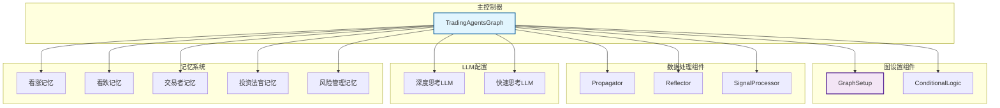
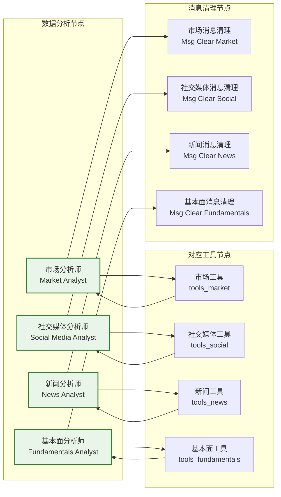
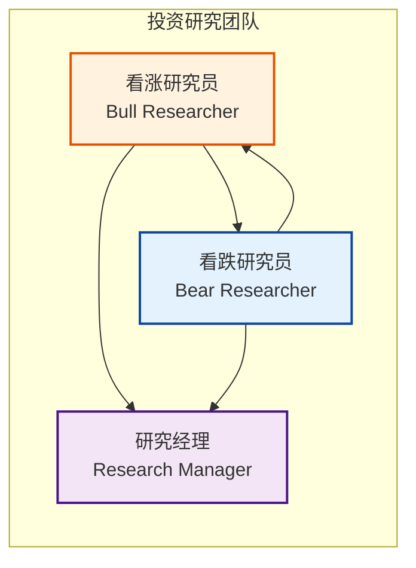
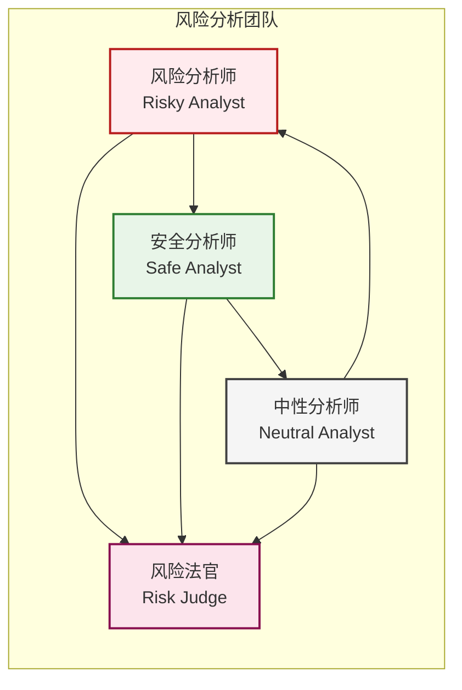
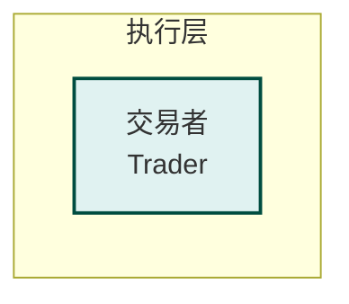
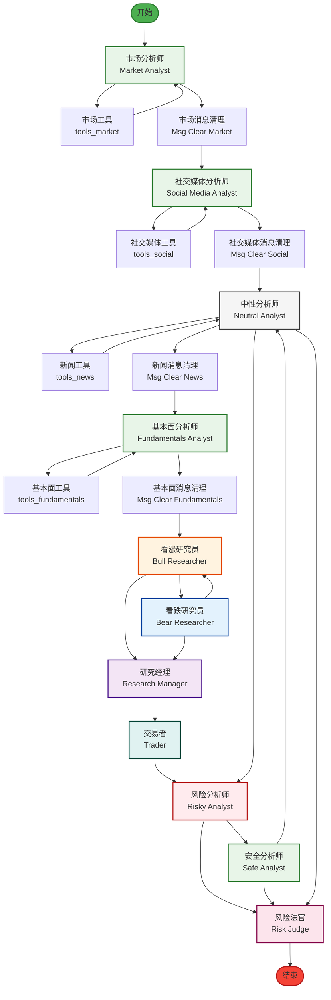

# LangGraph 交易代理系统架构分析

## 概述

本文档深入分析了 `tradingagents/graph/trading_graph.py` 文件中的 LangGraph 逻辑图设计，详细拆解了其节点、状态、边的设计思路和实现机制。

## 系统架构概览

### 核心组件关系图



## 1. 节点设计分析

### 1.1 节点分类体系

LangGraph 交易系统中的节点按照功能可以分为四大类：

#### A. 数据分析节点（Analyst Nodes）


**设计思路：**
- **专业化分工**：每个分析师节点专注于特定领域的数据分析
- **工具绑定**：每个分析师都有对应的工具节点，提供数据获取能力
- **消息管理**：专门的消息清理节点防止消息累积，保持状态清洁
- **模块化设计**：通过 `selected_analysts` 参数可以灵活配置启用的分析师

#### B. 投资研究节点（Research Nodes）


**设计思路：**
- **对立观点机制**：看涨和看跌研究员提供对立的投资观点
- **辩论式决策**：通过多轮辩论形成更全面的投资判断
- **最终裁决**：研究经理综合双方观点做出最终投资决策

#### C. 风险分析节点（Risk Analysis Nodes）


**设计思路：**
- **三维风险评估**：从风险、中性、安全三个角度评估投资方案
- **循环讨论**：三个分析师之间形成循环讨论机制
- **最终判断**：风险法官综合三方意见做出最终风险判断

#### D. 执行节点（Execution Nodes）


### 1.2 节点创建机制

节点创建采用了工厂模式，通过 `create_*` 函数统一创建：

```python
# 分析师节点创建
analyst_nodes["market"] = create_market_analyst(self.quick_thinking_llm, self.toolkit)
analyst_nodes["social"] = create_social_media_analyst(self.quick_thinking_llm, self.toolkit)
analyst_nodes["news"] = create_news_analyst(self.quick_thinking_llm, self.toolkit)
analyst_nodes["fundamentals"] = create_fundamentals_analyst(self.quick_thinking_llm, self.toolkit)

# 研究节点创建
bull_researcher_node = create_bull_researcher(self.quick_thinking_llm, self.bull_memory)
bear_researcher_node = create_bear_researcher(self.quick_thinking_llm, self.bear_memory)
research_manager_node = create_research_manager(self.deep_thinking_llm, self.invest_judge_memory)

# 风险分析节点创建
risky_analyst = create_risky_debator(self.quick_thinking_llm)
neutral_analyst = create_neutral_debator(self.quick_thinking_llm)
safe_analyst = create_safe_debator(self.quick_thinking_llm)
risk_manager_node = create_risk_manager(self.deep_thinking_llm, self.risk_manager_memory)
```

**设计优势：**
- **统一接口**：所有节点通过相同的工厂函数创建，保持接口一致性
- **配置灵活**：可以根据需要传入不同的 LLM 和记忆系统
- **职责分离**：节点创建逻辑与节点使用逻辑分离

## 2. 状态管理设计

### 2.1 状态层次结构

系统采用了三层状态设计：

```mermaid
graph TD
    subgraph "AgentState - 主状态"
        AS[AgentState<br/>继承自MessagesState]
        
        subgraph "基础信息"
            CI[company_of_interest<br/>目标公司]
            TD[trade_date<br/>交易日期]
            S[sender<br/>发送者]
        end
        
        subgraph "分析报告"
            MR[market_report<br/>市场报告]
            SR[sentiment_report<br/>情绪报告]
            NR[news_report<br/>新闻报告]
            FR[fundamentals_report<br/>基本面报告]
        end
        
        subgraph "投资辩论状态"
            IDS[investment_debate_state<br/>投资辩论状态]
            IP[investment_plan<br/>投资计划]
            TIP[trader_investment_plan<br/>交易者投资计划]
        end
        
        subgraph "风险分析状态"
            RDS[risk_debate_state<br/>风险辩论状态]
            FTD[final_trade_decision<br/>最终交易决策]
        end
        
        AS --> CI
        AS --> TD
        AS --> S
        AS --> MR
        AS --> SR
        AS --> NR
        AS --> FR
        AS --> IDS
        AS --> IP
        AS --> TIP
        AS --> RDS
        AS --> FTD
    end
    
    subgraph "InvestDebateState - 投资辩论状态"
        IDS --> BH[bull_history<br/>看涨历史]
        IDS --> BeH[bear_history<br/>看跌历史]
        IDS --> H[history<br/>对话历史]
        IDS --> CR[current_response<br/>当前回应]
        IDS --> JD[judge_decision<br/>法官决策]
        IDS --> C[count<br/>对话长度]
    end
    
    subgraph "RiskDebateState - 风险辩论状态"
        RDS --> RH[risky_history<br/>风险历史]
        RDS --> SH[safe_history<br/>安全历史]
        RDS --> NH[neutral_history<br/>中性历史]
        RDS --> H2[history<br/>对话历史]
        RDS --> LS[latest_speaker<br/>最新发言者]
        RDS --> CRR[current_risky_response<br/>当前风险回应]
        RDS --> CSR[current_safe_response<br/>当前安全回应]
        RDS --> CNR[current_neutral_response<br/>当前中性回应]
        RDS --> JD2[judge_decision<br/>法官决策]
        RDS --> C2[count<br/>对话长度]
    end
    
    style AS fill:#e3f2fd,stroke:#1565c0,stroke-width:3px
    style IDS fill:#fff3e0,stroke:#e65100,stroke-width:2px
    style RDS fill:#ffebee,stroke:#b71c1c,stroke-width:2px
```



### 2.2 状态设计特点

#### A. 类型安全的状态定义
```python
class AgentState(MessagesState):
    company_of_interest: Annotated[str, "Company that we are interested in trading"]
    trade_date: Annotated[str, "What date we are trading at"]
    sender: Annotated[str, "Agent that sent this message"]
    # ... 其他字段
```

**设计思路：**
- **类型注解**：使用 `Annotated` 提供详细的类型和描述信息
- **继承MessagesState**：利用 LangGraph 的消息状态管理能力
- **自文档化**：每个字段都有清晰的描述，提高代码可读性

#### B. 嵌套状态结构
```python
investment_debate_state: Annotated[
    InvestDebateState, "Current state of the debate on if to invest or not"
]
risk_debate_state: Annotated[
    RiskDebateState, "Current state of the debate on evaluating risk"
]
```

**设计思路：**
- **逻辑分组**：将相关的状态字段组织到嵌套结构中
- **模块化管理**：每个子状态可以独立管理和更新
- **清晰边界**：不同功能模块的状态边界清晰

#### C. 状态持久化机制
```python
def _log_state(self, trade_date, final_state):
    """Log the final state to a JSON file."""
    self.log_states_dict[str(trade_date)] = {
        "company_of_interest": final_state["company_of_interest"],
        "trade_date": final_state["trade_date"],
        # ... 完整状态序列化
    }
    
    # Save to file
    with open(f"eval_results/{self.ticker}/TradingAgentsStrategy_logs/full_states_log.json", "w") as f:
        json.dump(self.log_states_dict, f, indent=4)
```

**设计思路：**
- **完整记录**：保存每个交易日的完整状态信息
- **结构化存储**：使用 JSON 格式便于后续分析和调试
- **按股票分组**：不同股票的状态日志分别存储

## 3. 边和条件路由设计

### 3.1 整体流程图



### 3.2 条件路由逻辑

#### A. 分析师工具调用路由
```python
def should_continue_market(self, state: AgentState):
    """Determine if market analysis should continue."""
    messages = state["messages"]
    last_message = messages[-1]
    
    if hasattr(last_message, 'tool_calls') and last_message.tool_calls:
        return "tools_market"
    return "Msg Clear Market"
```

**设计思路：**
- **工具调用检测**：检查最后一条消息是否包含工具调用
- **状态机模式**：根据工具调用情况决定下一步流向
- **循环控制**：工具调用完成后自动清理消息

#### B. 投资辩论路由
```python
def should_continue_debate(self, state: AgentState) -> str:
    """Determine if debate should continue."""
    if state["investment_debate_state"]["count"] >= 2 * self.max_debate_rounds:
        return "Research Manager"
    if state["investment_debate_state"]["current_response"].startswith("Bull"):
        return "Bear Researcher"
    return "Bull Researcher"
```

**设计思路：**
- **轮次控制**：通过 `count` 字段控制辩论轮次
- **发言者追踪**：根据当前发言者决定下一个发言者
- **终止条件**：达到最大轮次后转向研究经理

#### C. 风险分析路由
```python
def should_continue_risk_analysis(self, state: AgentState) -> str:
    """Determine if risk analysis should continue."""
    if state["risk_debate_state"]["count"] >= 3 * self.max_risk_discuss_rounds:
        return "Risk Judge"
    if state["risk_debate_state"]["latest_speaker"].startswith("Risky"):
        return "Safe Analyst"
    if state["risk_debate_state"]["latest_speaker"].startswith("Safe"):
        return "Neutral Analyst"
    return "Risky Analyst"
```

**设计思路：**
- **三方循环**：风险、安全、中性分析师形成循环讨论
- **发言顺序**：按照固定的发言顺序进行讨论
- **综合判断**：达到轮次后由风险法官综合判断

### 3.3 边的连接模式

#### A. 顺序连接
```python
# 连接分析师序列
for i, analyst_type in enumerate(selected_analysts):
    if i < len(selected_analysts) - 1:
        next_analyst = f"{selected_analysts[i+1].capitalize()} Analyst"
        workflow.add_edge(current_clear, next_analyst)
    else:
        workflow.add_edge(current_clear, "Bull Researcher")
```

**设计思路：**
- **流水线模式**：分析师按照配置顺序依次执行
- **动态配置**：根据 `selected_analysts` 动态构建执行序列
- **终点连接**：最后一个分析师连接到研究阶段

#### B. 条件连接
```python
workflow.add_conditional_edges(
    "Bull Researcher",
    self.conditional_logic.should_continue_debate,
    {
        "Bear Researcher": "Bear Researcher",
        "Research Manager": "Research Manager",
    },
)
```

**设计思路：**
- **多目标路由**：一个节点可以连接到多个目标节点
- **条件函数**：通过独立的条件函数决定路由目标
- **映射关系**：使用字典明确映射条件结果到目标节点

## 4. 设计模式分析

### 4.1 使用的设计模式

#### A. 状态模式（State Pattern）
```python
class AgentState(MessagesState):
    # 状态定义
    company_of_interest: Annotated[str, "Company that we are interested in trading"]
    # ...
```

**应用场景：**
- 复杂的状态管理
- 状态转换逻辑集中化
- 状态持久化和恢复

#### B. 策略模式（Strategy Pattern）
```python
# 不同的LLM提供商配置
if self.config["llm_provider"].lower() == "openai":
    self.deep_thinking_llm = ChatOpenAI(...)
elif self.config["llm_provider"] == "siliconflow":
    self.deep_thinking_llm = ChatOpenAI(...)
elif self.config["llm_provider"] == "dashscope":
    self.deep_thinking_llm = ChatDashScopeOpenAI(...)
```

**应用场景：**
- 多LLM提供商支持
- 算法策略切换
- 配置驱动的行为变化

#### C. 工厂模式（Factory Pattern）
```python
analyst_nodes["market"] = create_market_analyst(self.quick_thinking_llm, self.toolkit)
bull_researcher_node = create_bull_researcher(self.quick_thinking_llm, self.bull_memory)
```

**应用场景：**
- 节点创建统一化
- 复杂对象构建
- 依赖注入管理

#### D. 观察者模式（Observer Pattern）
```python
def reflect_and_remember(self, returns_losses):
    """Reflect on decisions and update memory based on returns."""
    self.reflector.reflect_bull_researcher(self.curr_state, returns_losses, self.bull_memory)
    self.reflector.reflect_bear_researcher(self.curr_state, returns_losses, self.bear_memory)
    # ...
```

**应用场景：**
- 结果反馈和记忆更新
- 系统状态监控
- 事件驱动处理

### 4.2 架构原则

#### A. 单一职责原则（SRP）
- 每个节点专注于特定功能
- 状态管理、路由逻辑、节点创建分离
- 工具调用和业务逻辑分离

#### B. 开闭原则（OCP）
- 通过配置支持新的分析师类型
- 条件路由逻辑可扩展
- LLM提供商可插拔

#### C. 依赖倒置原则（DIP）
- 依赖抽象接口而非具体实现
- 通过工厂函数创建依赖
- 配置驱动的组件组装

## 5. 性能和可扩展性设计

### 5.1 性能优化策略

#### A. LLM资源管理
```python
# 双LLM策略
self.deep_thinking_llm = ChatOpenAI(model=self.config["deep_think_llm"], ...)
self.quick_thinking_llm = ChatOpenAI(model=self.config["quick_think_llm"], ...)
```

**设计思路：**
- **分层处理**：复杂任务使用深度思考LLM，简单任务使用快速LLM
- **资源优化**：根据任务复杂度分配计算资源
- **成本控制**：减少不必要的昂贵LLM调用

#### B. 记忆系统优化
```python
# 可选记忆系统
memory_enabled = self.config.get("memory_enabled", True)
if memory_enabled:
    self.bull_memory = FinancialSituationMemory("bull_memory", self.config)
else:
    self.bull_memory = None
```

**设计思路：**
- **按需启用**：记忆系统可以按需启用/禁用
- **资源节约**：不需要记忆时减少存储开销
- **性能调优**：根据场景选择是否使用记忆

#### C. 工具节点复用
```python
def _create_tool_nodes(self) -> Dict[str, ToolNode]:
    """Create tool nodes for different data sources."""
    return {
        "market": ToolNode([...]),
        "social": ToolNode([...]),
        # ...
    }
```

**设计思路：**
- **工具复用**：工具节点可以被多个分析师复用
- **资源集中**：相关工具集中管理
- **维护便利**：工具更新只需修改一处

### 5.2 可扩展性设计

#### A. 插件化分析师
```python
# 动态分析师选择
selected_analysts=["market", "social", "news", "fundamentals"]
```

**设计思路：**
- **即插即用**：新的分析师类型可以轻松添加
- **配置驱动**：通过配置文件控制启用哪些分析师
- **向后兼容**：新增分析师不影响现有逻辑

#### B. 多LLM提供商支持
```python
# 支持多种LLM提供商
elif self.config["llm_provider"] == "siliconflow":
    # SiliconFlow配置
elif self.config["llm_provider"] == "dashscope":
    # 阿里百炼配置
elif self.config["llm_provider"] == "deepseek":
    # DeepSeek配置
```

**设计思路：**
- **提供商无关**：业务逻辑与LLM提供商解耦
- **统一接口**：所有LLM通过统一接口调用
- **易于扩展**：新增提供商只需添加新的配置分支

#### C. 状态扩展性
```python
# 嵌套状态结构
investment_debate_state: Annotated[InvestDebateState, "..."]
risk_debate_state: Annotated[RiskDebateState, "..."]
```

**设计思路：**
- **模块化状态**：新增功能可以添加新的状态模块
- **向后兼容**：现有状态结构不受影响
- **类型安全**：新状态字段有明确的类型定义

## 6. 错误处理和容错机制

### 6.1 配置验证
```python
# LLM提供商验证
if self.config["llm_provider"].lower() == "openai":
    # OpenAI配置
elif self.config["llm_provider"] == "siliconflow":
    # SiliconFlow配置
else:
    raise ValueError(f"Unsupported LLM provider: {self.config['llm_provider']}")
```

**设计思路：**
- **早期验证**：在初始化阶段验证配置有效性
- **明确错误**：提供清晰的错误信息
- **防御性编程**：防止无效配置导致运行时错误

### 6.2 环境变量检查
```python
# API密钥检查
siliconflow_api_key = os.getenv('SILICONFLOW_API_KEY')
if not siliconflow_api_key:
    raise ValueError("使用SiliconFlow需要设置SILICONFLOW_API_KEY环境变量")
```

**设计思路：**
- **依赖检查**：确保必需的环境变量已设置
- **友好提示**：提供明确的配置指导
- **安全考虑**：避免在代码中硬编码敏感信息

### 6.3 调试模式支持
```python
# 调试模式执行
if self.debug:
    # Debug mode with tracing
    trace = []
    for chunk in self.graph.stream(init_agent_state, **args):
        # 详细追踪执行过程
else:
    # Standard mode without tracing
    final_state = self.graph.invoke(init_agent_state, **args)
```

**设计思路：**
- **开发友好**：提供详细的调试信息
- **性能优化**：生产环境可以关闭调试功能
- **问题诊断**：便于定位和解决问题

## 7. 总结和最佳实践

### 7.1 设计亮点

#### A. 模块化架构
- **清晰的职责分离**：每个组件有明确的职责
- **松耦合设计**：组件间通过接口交互
- **高内聚性**：相关功能集中管理

#### B. 灵活配置
- **多LLM支持**：支持多种LLM提供商
- **动态分析师**：可以灵活配置启用的分析师
- **可选功能**：记忆系统等功能可以按需启用

#### C. 状态管理
- **类型安全**：使用TypedDict确保状态类型安全
- **结构化设计**：嵌套状态结构清晰表达业务逻辑
- **持久化支持**：完整的状态记录和恢复机制

#### D. 条件路由
- **智能路由**：基于状态的条件路由逻辑
- **循环控制**：精确控制讨论轮次和流程
- **多路径支持**：支持复杂的决策流程

### 7.2 最佳实践建议

#### A. 代码组织
- **按功能分组**：相关功能应该组织在同一个模块中
- **命名规范**：使用清晰的命名表达组件用途
- **文档完善**：为复杂的逻辑提供详细的文档说明

#### B. 性能优化
- **资源管理**：合理使用LLM资源，避免不必要的调用
- **状态清理**：及时清理不需要的状态信息
- **缓存策略**：对重复计算的结果进行缓存

#### C. 可维护性
- **配置驱动**：通过配置文件控制行为，减少硬编码
- **错误处理**：完善的错误处理和日志记录
- **测试覆盖**：为关键逻辑编写单元测试

#### D. 扩展性
- **接口设计**：定义清晰的接口，便于后续扩展
- **插件化**：支持插件式的功能扩展
- **向后兼容**：新增功能时保持向后兼容性

### 7.3 适用场景

这种LangGraph设计模式特别适用于：

#### A. 复杂决策系统
- **多阶段决策**：需要经过多个分析阶段的决策系统
- **多方参与**：需要多个角色参与的决策过程
- **迭代优化**：需要通过多轮讨论优化的决策

#### B. 智能代理系统
- **专业分工**：需要多个专业代理协作的系统
- **知识整合**：需要整合多个领域知识的系统
- **自适应学习**：需要根据反馈调整行为的系统

#### C. 业务流程自动化
- **复杂流程**：具有复杂业务流程的系统
- **条件分支**：需要根据条件执行不同路径的系统
- **状态管理**：需要精确管理状态的系统

这个LangGraph交易代理系统展示了如何使用现代AI技术构建复杂的决策支持系统，其设计思路和实现方法对于构建类似的智能系统具有重要的参考价值。
