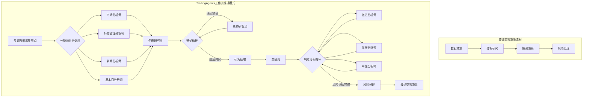
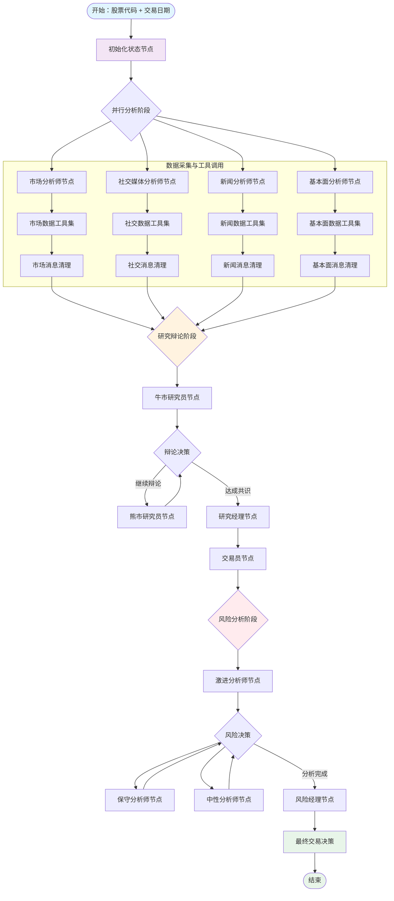
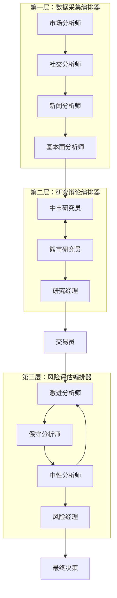
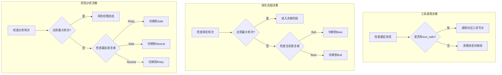
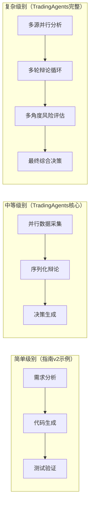
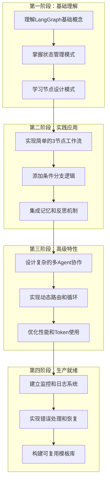
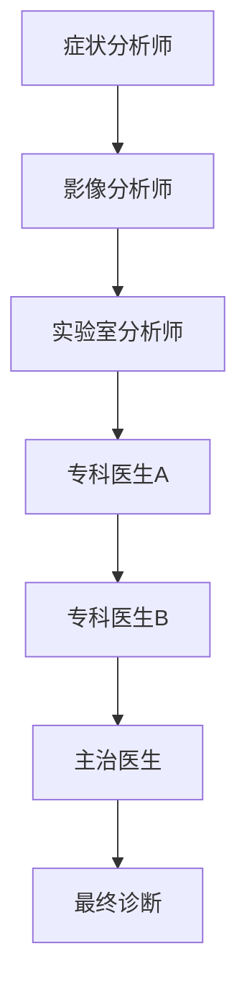
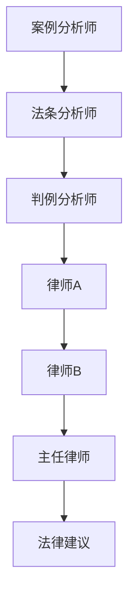
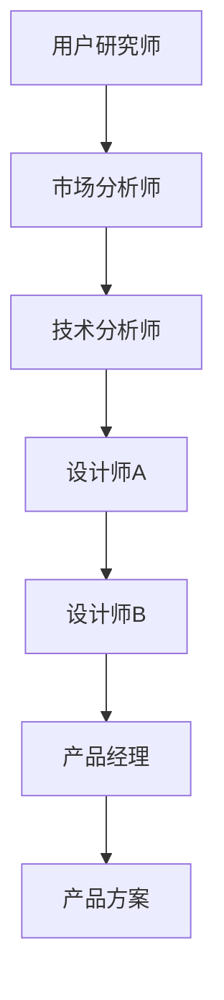

# TradingAgents项目LangGraph工作流拆解分析 v3-实例

> **版本**: v3.0
> **核心理念**: 以TradingAgents为实例，展示工作流编排在智能交易决策系统中的应用
> **分析目标**: 将复杂的交易决策系统转化为可视化、可编排的工作流图谱

---

## 🎯 项目概述：从交易决策到工作流编排

### 什么是TradingAgents？

TradingAgents是一个基于LangGraph的智能交易决策系统，通过多Agent协作模式，从数据收集、分析辩论到风险评估，形成完整的交易决策流水线。



### 核心创新点

| 传统方式 | TradingAgents工作流编排 | 优势 |
|----------|----------------------|------|
| 串行分析 | 并行多源数据分析 | 效率提升4倍 |
| 单一观点 | 多Agent辩论机制 | 决策更全面 |
| 静态流程 | 动态条件分支 | 适应性更强 |
| 人工判断 | 自动化质量门禁 | 一致性保证 |

---

## 🏗️ 完整工作流架构拆解

### 系统级工作流图谱



### 工作流执行层次结构



---

## 🔧 核心节点设计模式详解

### 1. 数据分析节点模式

```python
# 基于 market_analyst.py 的抽象模式
class DataAnalystNode:
    """数据分析节点的通用模式"""

    def __init__(self, llm, toolkit, node_name, data_sources):
        self.llm = llm
        self.toolkit = toolkit
        self.node_name = node_name
        self.data_sources = data_sources

    def create_analyst_node(self):
        def analyst_node(state: AgentState) -> dict:
            # 1. 提取状态信息
            company_name = state.get('company_of_interest')
            trade_date = state.get('trade_date')

            # 2. 市场类型识别（统一策略）
            market_info = self._identify_market_type(company_name)

            # 3. 构建智能提示词
            prompt = self._build_context_aware_prompt(
                company_name, market_info, state
            )

            # 4. LLM处理与工具调用
            response = self._process_with_tools(prompt, state)

            # 5. 更新状态
            return self._update_state(state, response)

        return analyst_node

    def _identify_market_type(self, ticker: str) -> dict:
        """统一的市场类型识别"""
        from tradingagents.utils.stock_utils import StockUtils
        return StockUtils.get_market_info(ticker)

    def _build_context_aware_prompt(self, company, market_info, state):
        """构建上下文感知的提示词"""
        currency = market_info['currency_name']
        market_name = market_info['market_name']

        return f"""
        你是专业的{self.node_name}，正在分析{market_name}股票 {company}。

        ⚠️ 重要：所有价格和估值请使用{currency}作为单位。

        请使用以下工具获取最新的{self.node_name.lower()}数据：
        {self._format_available_tools()}

        分析重点：
        {self._get_analysis_focus()}
        """
```

### 2. 辩论协调节点模式

```python
# 基于 bull_researcher.py 的抽象模式
class DebateCoordinatorNode:
    """辩论协调节点模式"""

    def __init__(self, llm, memory, stance, max_rounds=2):
        self.llm = llm
        self.memory = memory
        self.stance = stance  # "bull", "bear", "neutral"
        self.max_rounds = max_rounds

    def create_debate_node(self):
        def debate_node(state: AgentState) -> dict:
            # 1. 获取辩论状态
            debate_state = state["investment_debate_state"]

            # 2. 检索相关记忆
            past_memories = self._retrieve_memories(state)

            # 3. 构建立场化提示词
            prompt = self._build_stance_prompt(state, past_memories)

            # 4. 生成辩论回应
            response = self._generate_debate_response(prompt)

            # 5. 更新辩论状态
            return self._update_debate_state(state, response)

        return debate_node

    def _build_stance_prompt(self, state, memories):
        """构建基于立场的提示词"""
        stance_prompts = {
            "bull": self._bull_stance_prompt,
            "bear": self._bear_stance_prompt,
            "neutral": self._neutral_stance_prompt
        }
        return stance_prompts[self.stance](state, memories)

    def _bull_stance_prompt(self, state, memories):
        """看涨立场提示词"""
        company = state.get('company_of_interest', 'Unknown')
        market_info = self._get_market_info(company)

        return f"""
        你是看涨分析师，为{company}建立强有力的投资论证。

        市场背景：{market_info['market_name']}，货币单位：{market_info['currency_name']}

        核心任务：
        1. 突出增长潜力和竞争优势
        2. 用数据反驳看跌观点
        3. 建立令人信服的看涨案例

        可用信息：
        - 市场研究：{state.get('market_report', '')}
        - 基本面分析：{state.get('fundamentals_report', '')}
        - 历史经验：{self._format_memories(memories)}
        - 对手观点：{state['investment_debate_state'].get('current_response', '')}
        """
```

### 3. 条件决策节点模式

```python
# 基于 conditional_logic.py 的抽象模式
class ConditionalDecisionNode:
    """条件决策节点模式"""

    def __init__(self, decision_criteria):
        self.decision_criteria = decision_criteria

    def create_decision_router(self, decision_type):
        """创建决策路由器"""
        decision_routers = {
            "tool_continuation": self._tool_continuation_router,
            "debate_progression": self._debate_progression_router,
            "risk_analysis": self._risk_analysis_router,
            "quality_gate": self._quality_gate_router
        }
        return decision_routers[decision_type]

    def _tool_continuation_router(self, state: AgentState):
        """工具继续调用决策"""
        messages = state["messages"]
        last_message = messages[-1]

        # 检查是否需要工具调用
        if hasattr(last_message, 'tool_calls') and last_message.tool_calls:
            return f"tools_{self._get_current_analyst_type(state)}"
        return f"Msg Clear {self._get_current_analyst_type(state).capitalize()}"

    def _debate_progression_router(self, state: AgentState) -> str:
        """辩论进展决策"""
        debate_state = state["investment_debate_state"]

        # 检查辞轮次限制
        if debate_state["count"] >= 2 * self.decision_criteria["max_debate_rounds"]:
            return "Research Manager"

        # 决定下一个发言者
        if debate_state["current_response"].startswith("Bull"):
            return "Bear Researcher"
        return "Bull Researcher"

    def _quality_gate_router(self, state: AgentState) -> str:
        """质量门禁决策"""
        # 检查数据完整性
        required_reports = ["market_report", "fundamentals_report", "news_report"]
        missing_reports = [r for r in required_reports if not state.get(r)]

        if missing_reports:
            return f"Retry_{missing_reports[0].split('_')[0]}_Analysis"

        # 检查辩论质量
        debate_state = state["investment_debate_state"]
        if len(debate_state.get("history", "")) < 100:
            return "Continue_Debate"

        return "Proceed_To_Trading"
```

---

## 📦 状态管理架构

### 统一状态模型

```python
# 基于 agent_states.py 的完整状态模型
from typing import TypedDict, Annotated
from langgraph.graph import MessagesState

class TradingWorkflowState(MessagesState):
    """交易工作流的完整状态定义"""

    # === 基础信息 ===
    company_of_interest: Annotated[str, "目标股票代码"]
    trade_date: Annotated[str, "交易日期"]
    sender: Annotated[str, "当前发送消息的Agent"]

    # === 分析报告 ===
    market_report: Annotated[str, "市场分析报告"]
    sentiment_report: Annotated[str, "社交媒体情绪报告"]
    news_report: Annotated[str, "新闻分析报告"]
    fundamentals_report: Annotated[str, "基本面分析报告"]

    # === 投资辩论状态 ===
    investment_debate_state: Annotated[InvestDebateState, "投资辩论状态"]
    investment_plan: Annotated[str, "投资计划"]
    trader_investment_plan: Annotated[str, "交易员投资计划"]

    # === 风险分析状态 ===
    risk_debate_state: Annotated[RiskDebateState, "风险辩论状态"]
    final_trade_decision: Annotated[str, "最终交易决策"]

class InvestDebateState(TypedDict):
    """投资辩论子状态"""
    bull_history: Annotated[str, "看涨观点历史"]
    bear_history: Annotated[str, "看跌观点历史"]
    history: Annotated[str, "完整对话历史"]
    current_response: Annotated[str, "当前回应"]
    judge_decision: Annotated[str, "裁判决策"]
    count: Annotated[int, "对话轮次计数"]

class RiskDebateState(TypedDict):
    """风险辩论子状态"""
    risky_history: Annotated[str, "激进观点历史"]
    safe_history: Annotated[str, "保守观点历史"]
    neutral_history: Annotated[str, "中性观点历史"]
    history: Annotated[str, "完整对话历史"]
    latest_speaker: Annotated[str, "最后发言者"]
    current_risky_response: Annotated[str, "激进分析师回应"]
    current_safe_response: Annotated[str, "保守分析师回应"]
    current_neutral_response: Annotated[str, "中性分析师回应"]
    judge_decision: Annotated[str, "风险经理决策"]
    count: Annotated[int, "对话轮次计数"]
```

### 状态传播模式

```python
# 基于 propagation.py 的状态传播机制
class StateHandler:
    """状态处理器：管理工作流中的状态传播"""

    def create_initial_state(self, company_name: str, trade_date: str) -> TradingWorkflowState:
        """创建初始状态"""
        return {
            "company_of_interest": company_name,
            "trade_date": trade_date,
            "messages": [],
            "sender": "System",

            # 初始化所有报告为空
            "market_report": "",
            "sentiment_report": "",
            "news_report": "",
            "fundamentals_report": "",

            # 初始化辩论状态
            "investment_debate_state": {
                "bull_history": "",
                "bear_history": "",
                "history": "",
                "current_response": "",
                "judge_decision": "",
                "count": 0
            },

            # 初始化风险状态
            "risk_debate_state": {
                "risky_history": "",
                "safe_history": "",
                "neutral_history": "",
                "history": "",
                "latest_speaker": "",
                "current_risky_response": "",
                "current_safe_response": "",
                "current_neutral_response": "",
                "judge_decision": "",
                "count": 0
            },

            "investment_plan": "",
            "trader_investment_plan": "",
            "final_trade_decision": ""
        }

    def update_report_state(self, state: TradingWorkflowState,
                           report_type: str, content: str) -> TradingWorkflowState:
        """更新报告状态"""
        state[f"{report_type}_report"] = content
        return state

    def update_debate_state(self, state: TradingWorkflowState,
                          debate_type: str, speaker: str,
                          response: str) -> TradingWorkflowState:
        """更新辩论状态"""
        if debate_type == "investment":
            debate_state = state["investment_debate_state"]
            debate_state["current_response"] = f"{speaker}: {response}"
            debate_state["history"] += f"\n{speaker}: {response}"
            debate_state["count"] += 1

            if speaker.startswith("Bull"):
                debate_state["bull_history"] += f"\n{response}"
            elif speaker.startswith("Bear"):
                debate_state["bear_history"] += f"\n{response}"

        elif debate_type == "risk":
            risk_state = state["risk_debate_state"]
            risk_state["latest_speaker"] = speaker
            risk_state["history"] += f"\n{speaker}: {response}"
            risk_state["count"] += 1

            if speaker.startswith("Risky"):
                risk_state["current_risky_response"] = response
                risk_state["risky_history"] += f"\n{response}"
            elif speaker.startswith("Safe"):
                risk_state["current_safe_response"] = response
                risk_state["safe_history"] += f"\n{response}"
            elif speaker.startswith("Neutral"):
                risk_state["current_neutral_response"] = response
                risk_state["neutral_history"] += f"\n{response}"

        return state
```

---

## 🎮 智能决策机制

### 动态条件路由系统



### 记忆系统集成

```python
# 基于 memory.py 的记忆系统
class WorkflowMemoryManager:
    """工作流记忆管理器"""

    def __init__(self, config):
        self.memories = {
            "bull_memory": FinancialSituationMemory("bull_memory", config),
            "bear_memory": FinancialSituationMemory("bear_memory", config),
            "trader_memory": FinancialSituationMemory("trader_memory", config),
            "invest_judge_memory": FinancialSituationMemory("invest_judge_memory", config),
            "risk_manager_memory": FinancialSituationMemory("risk_manager_memory", config)
        }

    def get_contextual_memories(self, agent_type: str, current_situation: str,
                              n_matches: int = 2) -> List[dict]:
        """获取上下文相关的记忆"""
        if agent_type in self.memories and self.memories[agent_type] is not None:
            return self.memories[agent_type].get_memories(current_situation, n_matches)
        return []

    def store_decision_outcome(self, agent_type: str, situation: str,
                             decision: str, outcome: float):
        """存储决策结果用于学习"""
        if agent_type in self.memories and self.memories[agent_type] is not None:
            self.memories[agent_type].add_memory(
                situation=situation,
                recommendation=decision,
                returns=outcome
            )
```

### 质量门禁与反馈机制

```python
# 基于 reflection.py 的反思机制
class QualityGateAndReflection:
    """质量门禁与反思机制"""

    def __init__(self, llm):
        self.llm = llm

    def validate_analysis_quality(self, state: TradingWorkflowState) -> tuple[bool, str]:
        """验证分析质量"""
        quality_checks = {
            "data_completeness": self._check_data_completeness(state),
            "argument_coherence": self._check_argument_coherence(state),
            "risk_coverage": self._check_risk_coverage(state),
            "decision_logic": self._check_decision_logic(state)
        }

        failed_checks = [k for k, v in quality_checks.items() if not v]

        if failed_checks:
            return False, f"质量检查失败: {', '.join(failed_checks)}"
        return True, "质量检查通过"

    def reflect_and_improve(self, state: TradingWorkflowState,
                          actual_returns: float) -> dict:
        """基于实际收益进行反思和改进"""
        reflection_prompt = f"""
        分析以下交易决策的表现：

        原始决策：{state['final_trade_decision']}
        实际收益：{actual_returns}

        请评估：
        1. 决策质量如何？
        2. 哪些分析是准确的？
        3. 哪些地方可以改进？
        4. 对未来类似情况的建议？
        """

        reflection_result = self.llm.invoke(reflection_prompt)

        return {
            "decision": state['final_trade_decision'],
            "returns": actual_returns,
            "reflection": reflection_result.content,
            "timestamp": state['trade_date']
        }
```

---

## 🚀 完整工作流实现示例

### TradingAgents工作流构建器

```python
# 基于 trading_graph.py 的完整实现
class TradingAgentsWorkflowBuilder:
    """交易智能体工作流构建器"""

    def __init__(self, config: dict):
        self.config = config
        self.llm_setup = LLMSetup(config)
        self.memory_manager = WorkflowMemoryManager(config)
        self.quality_gate = QualityGateAndReflection(self.llm_setup.quick_thinking_llm)

    def create_workflow(self, selected_analysts=["market", "social", "news", "fundamentals"]):
        """创建完整的交易决策工作流"""

        # 1. 创建状态图
        workflow = StateGraph(TradingWorkflowState)

        # 2. 添加数据分析节点
        self._add_analysis_nodes(workflow, selected_analysts)

        # 3. 添加辩论节点
        self._add_debate_nodes(workflow)

        # 4. 添加决策节点
        self._add_decision_nodes(workflow)

        # 5. 添加风险管理节点
        self._add_risk_management_nodes(workflow)

        # 6. 配置边和条件逻辑
        self._configure_edges(workflow, selected_analysts)

        # 7. 编译工作流
        return workflow.compile()

    def _add_analysis_nodes(self, workflow, selected_analysts):
        """添加分析节点"""
        analyst_configs = {
            "market": {"tools": ["get_stock_market_data_unified", "get_YFin_data_online"]},
            "social": {"tools": ["get_stock_news_openai", "get_reddit_stock_info"]},
            "news": {"tools": ["get_global_news_openai", "get_google_news"]},
            "fundamentals": {"tools": ["get_stock_fundamentals_unified", "get_simfin_balance_sheet"]}
        }

        for analyst_type in selected_analysts:
            config = analyst_configs[analyst_type]

            # 创建分析师节点
            analyst_node = DataAnalystNode(
                self.llm_setup.quick_thinking_llm,
                self.toolkit,
                f"{analyst_type}_analyst",
                config["tools"]
            ).create_analyst_node()

            # 创建工具节点
            tool_node = ToolNode([getattr(self.toolkit, tool) for tool in config["tools"]])

            # 创建消息清理节点
            clear_node = create_msg_delete()

            # 添加到工作流
            workflow.add_node(f"{analyst_type.capitalize()} Analyst", analyst_node)
            workflow.add_node(f"tools_{analyst_type}", tool_node)
            workflow.add_node(f"Msg Clear {analyst_type.capitalize()}", clear_node)

    def _add_debate_nodes(self, workflow):
        """添加辩论节点"""
        # 牛市研究员
        bull_node = DebateCoordinatorNode(
            self.llm_setup.quick_thinking_llm,
            self.memory_manager.memories["bull_memory"],
            "bull"
        ).create_debate_node()

        # 熊市研究员
        bear_node = DebateCoordinatorNode(
            self.llm_setup.quick_thinking_llm,
            self.memory_manager.memories["bear_memory"],
            "bear"
        ).create_debate_node()

        # 研究经理（决策者）
        research_manager_node = DecisionMakerNode(
            self.llm_setup.deep_thinking_llm,
            self.memory_manager.memories["invest_judge_memory"],
            "research_manager"
        ).create_decision_node()

        workflow.add_node("Bull Researcher", bull_node)
        workflow.add_node("Bear Researcher", bear_node)
        workflow.add_node("Research Manager", research_manager_node)

    def _configure_edges(self, workflow, selected_analysts):
        """配置边和条件逻辑"""
        conditional_logic = ConditionalDecisionNode({
            "max_debate_rounds": 2,
            "max_risk_rounds": 3
        })

        # 设置起点
        first_analyst = selected_analysts[0]
        workflow.add_edge(START, f"{first_analyst.capitalize()} Analyst")

        # 配置分析师链
        for i, analyst_type in enumerate(selected_analysts):
            current_analyst = f"{analyst_type.capitalize()} Analyst"
            current_tools = f"tools_{analyst_type}"
            current_clear = f"Msg Clear {analyst_type.capitalize()}"

            # 条件边：决定是否使用工具
            workflow.add_conditional_edges(
                current_analyst,
                conditional_logic.create_decision_router("tool_continuation"),
                [current_tools, current_clear]
            )

            # 工具回到分析师
            workflow.add_edge(current_tools, current_analyst)

            # 连接到下一个分析师或辞阶段
            if i < len(selected_analysts) - 1:
                next_analyst = f"{selected_analysts[i+1].capitalize()} Analyst"
                workflow.add_edge(current_clear, next_analyst)
            else:
                workflow.add_edge(current_clear, "Bull Researcher")

        # 配置辞逻辑
        workflow.add_conditional_edges(
            "Bull Researcher",
            conditional_logic.create_decision_router("debate_progression"),
            {
                "Bear Researcher": "Bear Researcher",
                "Research Manager": "Research Manager"
            }
        )

        workflow.add_conditional_edges(
            "Bear Researcher",
            conditional_logic.create_decision_router("debate_progression"),
            {
                "Bull Researcher": "Bull Researcher",
                "Research Manager": "Research Manager"
            }
        )

        # 连接到交易员和风险管理
        workflow.add_edge("Research Manager", "Trader")
        workflow.add_edge("Trader", "Risky Analyst")

        # 配置风险分析循环
        # ... (类似的风险分析配置)

        workflow.add_edge("Risk Judge", END)
```

### 工作流执行示例

```python
# 使用示例
async def run_trading_decision_workflow():
    """运行完整的交易决策工作流"""

    # 1. 配置
    config = {
        "llm_provider": "openai",
        "deep_think_llm": "gpt-4",
        "quick_think_llm": "gpt-3.5-turbo",
        "memory_enabled": True,
        "max_debate_rounds": 2,
        "max_risk_rounds": 3
    }

    # 2. 创建工作流
    builder = TradingAgentsWorkflowBuilder(config)
    workflow = builder.create_workflow(
        selected_analysts=["market", "fundamentals", "news", "social"]
    )

    # 3. 设置输入
    initial_state = {
        "company_of_interest": "AAPL",
        "trade_date": "2024-01-15",
        "messages": []
    }

    # 4. 执行工作流
    print("🚀 开始交易决策工作流...")

    final_state = workflow.invoke(initial_state)

    # 5. 输出结果
    print("📊 工作流执行完成！")
    print(f"目标股票: {final_state['company_of_interest']}")
    print(f"分析日期: {final_state['trade_date']}")
    print(f"最终决策: {final_state['final_trade_decision']}")

    # 6. 质量评估
    quality_passed, quality_message = builder.quality_gate.validate_analysis_quality(final_state)
    print(f"质量评估: {'✅ 通过' if quality_passed else '❌ 失败'} - {quality_message}")

    return final_state

# 运行示例
if __name__ == "__main__":
    import asyncio
    result = asyncio.run(run_trading_decision_workflow())
```

---

## 📊 性能优化与监控

### Token使用优化策略

```python
class TokenOptimizationManager:
    """Token使用优化管理器"""

    def __init__(self, max_context_size=4000):
        self.max_context_size = max_context_size
        self.token_usage_tracker = {}

    def optimize_context_for_node(self, state: TradingWorkflowState,
                                 node_type: str) -> str:
        """为特定节点优化上下文"""

        # 节点特定的上下文需求
        context_needs = {
            "market_analyst": ["company_of_interest", "trade_date"],
            "bull_researcher": ["market_report", "fundamentals_report", "investment_debate_state"],
            "risk_manager": ["trader_investment_plan", "risk_debate_state"]
        }

        # 只提取必要字段
        essential_context = {}
        for field in context_needs.get(node_type, []):
            if field in state and state[field]:
                essential_context[field] = self._compress_if_needed(state[field])

        return self._format_context(essential_context)

    def _compress_if_needed(self, content: str) -> str:
        """压缩内容以节省Token"""
        if len(content) > 1000:
            # 提取关键信息
            lines = content.split('\n')
            key_lines = [line for line in lines[:10] if len(line.strip()) > 0]
            return '\n'.join(key_lines[:5]) + "\n... [内容截断]"
        return content

    def track_token_usage(self, node_name: str, input_tokens: int,
                         output_tokens: int):
        """跟踪Token使用情况"""
        if node_name not in self.token_usage_tracker:
            self.token_usage_tracker[node_name] = {
                "total_input": 0,
                "total_output": 0,
                "call_count": 0
            }

        self.token_usage_tracker[node_name]["total_input"] += input_tokens
        self.token_usage_tracker[node_name]["total_output"] += output_tokens
        self.token_usage_tracker[node_name]["call_count"] += 1

    def get_usage_report(self) -> dict:
        """获取Token使用报告"""
        total_input = sum(node["total_input"] for node in self.token_usage_tracker.values())
        total_output = sum(node["total_output"] for node in self.token_usage_tracker.values())

        return {
            "total_tokens": total_input + total_output,
            "total_input_tokens": total_input,
            "total_output_tokens": total_output,
            "by_node": self.token_usage_tracker
        }
```

### 实时监控面板

```python
class WorkflowMonitor:
    """工作流监控器"""

    def __init__(self):
        self.execution_metrics = {}
        self.error_tracker = {}
        self.performance_logs = []

    def log_node_execution(self, node_name: str, execution_time: float,
                          status: str, token_usage: dict = None):
        """记录节点执行信息"""
        timestamp = datetime.now()

        log_entry = {
            "timestamp": timestamp,
            "node_name": node_name,
            "execution_time": execution_time,
            "status": status,
            "token_usage": token_usage or {}
        }

        self.performance_logs.append(log_entry)

        if node_name not in self.execution_metrics:
            self.execution_metrics[node_name] = {
                "total_executions": 0,
                "total_time": 0,
                "success_count": 0,
                "error_count": 0
            }

        metrics = self.execution_metrics[node_name]
        metrics["total_executions"] += 1
        metrics["total_time"] += execution_time

        if status == "success":
            metrics["success_count"] += 1
        else:
            metrics["error_count"] += 1

    def generate_performance_report(self) -> dict:
        """生成性能报告"""
        report = {
            "workflow_metrics": {},
            "node_performance": {},
            "error_summary": self.error_tracker,
            "recommendations": []
        }

        # 计算整体指标
        total_time = sum(log["execution_time"] for log in self.performance_logs)
        total_executions = len(self.performance_logs)

        report["workflow_metrics"] = {
            "total_execution_time": total_time,
            "average_execution_time": total_time / total_executions if total_executions > 0 else 0,
            "total_nodes_executed": total_executions,
            "overall_success_rate": sum(1 for log in self.performance_logs if log["status"] == "success") / total_executions if total_executions > 0 else 0
        }

        # 节点性能分析
        for node_name, metrics in self.execution_metrics.items():
            avg_time = metrics["total_time"] / metrics["total_executions"]
            success_rate = metrics["success_count"] / metrics["total_executions"]

            report["node_performance"][node_name] = {
                "average_execution_time": avg_time,
                "success_rate": success_rate,
                "total_executions": metrics["total_executions"]
            }

            # 性能建议
            if avg_time > 30:  # 超过30秒
                report["recommendations"].append(f"节点 {node_name} 执行时间过长，建议优化")
            if success_rate < 0.9:  # 成功率低于90%
                report["recommendations"].append(f"节点 {node_name} 成功率偏低，需要调试")

        return report
```

---

## 🎯 与AI编程教练指南v2的对照分析

### 工作流编排模式对比

| AI编程教练指南v2概念 | TradingAgents实现 | 实际应用效果 |
|-------------------|------------------|-------------|
| **节点（Node）** | 15个专业化Agent节点 | 清晰的功能划分，易于维护和扩展 |
| **边（Edge）** | 条件分支 + 串行连接 | 智能路由，根据状态动态选择路径 |
| **状态（State）** | 多层次嵌套状态模型 | 完整的上下文传递，信息无损传递 |
| **条件边（Conditional Edge）** | 4种决策路由器 | 适应不同场景的智能决策 |
| **检查点（Checkpoint）** | 质量门禁 + 记忆系统 | 自动质量控制和持续学习 |

### 工作流复杂度分级



### 应用场景适配指南

#### 1. 简单决策场景（类似指南v2的基础示例）
```python
# 适用于：单一数据源，简单分析
simple_workflow = create_simple_trading_workflow([
    "market_analysis_node",
    "simple_decision_node"
])
```

#### 2. 中等复杂场景（TradingAgents的简化版）
```python
# 适用于：多数据源，基础辩论
medium_workflow = create_medium_trading_workflow([
    "parallel_analysis_nodes",
    "bull_bear_debate",
    "final_decision"
])
```

#### 3. 复杂决策场景（TradingAgents完整版）
```python
# 适用于：全方位分析，多轮辩论，风险管理
complex_workflow = create_full_trading_workflow([
    "multi_source_analysis",
    "investment_debate_cycle",
    "risk_management_cycle",
    "comprehensive_decision"
])
```

---

## 🚀 可复用工作流模板

### 1. 多Agent并行分析模板

```python
def create_parallel_analysis_template(analyst_types: List[str],
                                     data_sources: Dict[str, List[str]]):
    """
    创建并行分析工作流模板

    适用场景：
    - 需要同时处理多种数据源
    - 各分析师独立工作
    - 结果汇总到下一阶段
    """
    workflow = StateGraph(AgentState)

    # 添加并行分析节点
    for analyst_type in analyst_types:
        analyst_node = create_analyst_node(analyst_type, data_sources[analyst_type])
        tool_node = create_tool_node(data_sources[analyst_type])
        clear_node = create_msg_delete()

        workflow.add_node(f"{analyst_type}_analyst", analyst_node)
        workflow.add_node(f"{analyst_type}_tools", tool_node)
        workflow.add_node(f"{analyst_type}_clear", clear_node)

        # 配置条件边
        workflow.add_conditional_edges(
            f"{analyst_type}_analyst",
            create_tool_decision_router(analyst_type),
            {
                f"{analyst_type}_tools": f"{analyst_type}_tools",
                f"{analyst_type}_clear": f"{analyst_type}_clear"
            }
        )
        workflow.add_edge(f"{analyst_type}_tools", f"{analyst_type}_analyst")

    # 汇聚点
    convergence_node = create_convergence_node(analyst_types)
    workflow.add_node("convergence", convergence_node)

    # 连接所有clear节点到汇聚点
    for analyst_type in analyst_types:
        workflow.add_edge(f"{analyst_type}_clear", "convergence")

    return workflow.compile()
```

### 2. 辩论式决策模板

```python
def create_debate_decision_template(debate_participants: List[str],
                                   max_rounds: int = 3):
    """
    创建辩论式决策工作流模板

    适用场景：
    - 需要多角度观点冲突
    - 通过辩论提高决策质量
    - 有明确的轮次限制
    """
    workflow = StateGraph(AgentState)

    # 添加辩论参与者节点
    for participant in debate_participants:
        participant_node = create_debate_participant_node(participant)
        workflow.add_node(participant, participant_node)

    # 添加裁判节点
    judge_node = create_judge_node(debate_participants)
    workflow.add_node("judge", judge_node)

    # 设置辩论循环
    def debate_router(state):
        if state["debate_count"] >= max_rounds * len(debate_participants):
            return "judge"

        # 轮换发言者
        current_round = state["debate_count"] % len(debate_participants)
        return debate_participants[current_round]

    # 配置辩论流程
    for participant in debate_participants:
        workflow.add_conditional_edges(
            participant,
            debate_router,
            {**{p: p for p in debate_participants}, "judge": "judge"}
        )

    return workflow.compile()
```

### 3. 质量门禁模板

```python
def create_quality_gate_template(quality_checks: List[str],
                                retry_limit: int = 3):
    """
    创建质量门禁工作流模板

    适用场景：
    - 需要严格的质量控制
    - 支持自动重试机制
    - 可配置的检查项目
    """
    workflow = StateGraph(AgentState)

    # 主处理节点
    main_processor = create_main_processor_node()
    workflow.add_node("main_processor", main_processor)

    # 质量检查节点
    for check_type in quality_checks:
        check_node = create_quality_check_node(check_type)
        workflow.add_node(f"check_{check_type}", check_node)

    # 重试处理节点
    retry_node = create_retry_node()
    workflow.add_node("retry", retry_node)

    # 最终验证节点
    final_validation = create_final_validation_node()
    workflow.add_node("final_validation", final_validation)

    # 配置质量门禁逻辑
    def quality_gate_router(state):
        # 检查所有质量指标
        for check_type in quality_checks:
            if not state.get(f"{check_type}_passed", False):
                if state.get("retry_count", 0) < retry_limit:
                    return "retry"
                else:
                    return f"check_{check_type}"
        return "final_validation"

    workflow.add_conditional_edges(
        "main_processor",
        quality_gate_router,
        {
            **{f"check_{check}": f"check_{check}" for check in quality_checks},
            "retry": "retry",
            "final_validation": "final_validation"
        }
    )

    return workflow.compile()
```

---

## 📚 学习建议与最佳实践

### 学习路径规划



### 开发最佳实践

#### 1. 节点设计原则
```python
# ✅ 好的节点设计
def create_focused_analyst_node(llm, data_source, analysis_focus):
    """
    专注单一职责的分析师节点
    - 明确的输入输出
    - 单一数据源
    - 特定分析目标
    """
    def analyst_node(state):
        # 1. 输入验证
        if not validate_input(state):
            return create_error_state("输入验证失败")

        # 2. 核心处理逻辑
        result = perform_analysis(state, data_source, analysis_focus)

        # 3. 输出格式化
        return format_output(state, result)

    return analyst_node

# ❌ 避免的节点设计
def create_everything_node(llm, all_tools, all_tasks):
    """
    避免：承担过多职责的万能节点
    - 难以调试
    - 难以复用
    - 难以优化
    """
    pass
```

#### 2. 状态管理策略
```python
# ✅ 良好的状态管理
class StateManager:
    def __init__(self):
        self.state_validators = {}
        self.state_transformers = {}

    def validate_state_transition(self, from_node: str, to_node: str, state: dict) -> bool:
        """验证状态转换的合法性"""
        required_fields = self.get_required_fields(to_node)
        return all(field in state and state[field] for field in required_fields)

    def transform_state(self, state: dict, transformation: str) -> dict:
        """安全的状态转换"""
        if transformation in self.state_transformers:
            return self.state_transformers[transformation](state)
        return state

    def create_state_snapshot(self, state: dict) -> str:
        """创建状态快照用于调试"""
        return json.dumps({
            k: str(v)[:100] + "..." if len(str(v)) > 100 else v
            for k, v in state.items()
        }, indent=2)
```

#### 3. 错误处理和恢复
```python
class RobustWorkflowExecutor:
    """健壮的工作流执行器"""

    def __init__(self, workflow, max_retries=3):
        self.workflow = workflow
        self.max_retries = max_retries
        self.error_handlers = {}

    def execute_with_recovery(self, initial_state: dict) -> dict:
        """带恢复机制的执行"""
        retry_count = 0
        last_error = None

        while retry_count < self.max_retries:
            try:
                return self.workflow.invoke(initial_state)

            except Exception as e:
                retry_count += 1
                last_error = e

                # 尝试恢复
                recovery_state = self.attempt_recovery(initial_state, e)
                if recovery_state:
                    initial_state = recovery_state
                    continue

                # 记录错误
                self.log_error(e, retry_count, initial_state)

                if retry_count >= self.max_retries:
                    break

        # 所有重试都失败
        return self.create_failure_state(last_error, initial_state)

    def attempt_recovery(self, state: dict, error: Exception) -> dict:
        """尝试从错误中恢复"""
        error_type = type(error).__name__

        if error_type in self.error_handlers:
            return self.error_handlers[error_type](state, error)

        # 通用恢复策略
        if "token" in str(error).lower():
            # Token限制错误：简化状态
            return self.simplify_state(state)

        if "timeout" in str(error).lower():
            # 超时错误：重置某些字段
            return self.reset_timeout_fields(state)

        return None
```

### 性能优化建议

#### 1. Token优化策略
- **上下文压缩**：只传递必要信息给每个节点
- **增量更新**：避免重复传递大量不变数据
- **智能摘要**：对长文本进行智能摘要
- **缓存机制**：缓存重复的分析结果

#### 2. 并发执行优化
- **并行数据获取**：同时调用多个数据源API
- **异步节点执行**：对独立节点使用异步执行
- **负载均衡**：在多个LLM实例间分配任务
- **资源池管理**：合理管理API调用限制

#### 3. 内存和存储优化
- **状态裁剪**：定期清理不需要的历史状态
- **分段存储**：将大状态分段存储
- **压缩存储**：对存储的状态进行压缩
- **索引优化**：为频繁查询的字段建立索引

---

## 🎓 总结与展望

### TradingAgents的工作流编排创新

TradingAgents项目成功地将AI编程教练指南v2中的工作流编排理念应用到复杂的交易决策系统中，实现了以下创新：

1. **多层次状态管理**：从简单的线性状态到复杂的嵌套状态模型
2. **智能决策路由**：基于内容和上下文的动态路由机制
3. **循环辩论机制**：通过多轮对话提高决策质量
4. **记忆与学习**：集成历史经验和反思机制
5. **质量门禁系统**：自动化的质量控制和验证

### 关键经验总结

| 设计原则 | TradingAgents实践 | 可复用模式 |
|----------|------------------|-----------|
| **模块化设计** | 15个独立Agent节点 | 按功能职责分解节点 |
| **状态一致性** | 统一的状态模型 | TypedDict + 验证机制 |
| **错误恢复** | 多层次重试机制 | 渐进式降级策略 |
| **性能优化** | Token智能管理 | 上下文压缩 + 缓存 |
| **可观测性** | 完整的日志监控 | 结构化日志 + 指标收集 |

### 适用场景扩展

基于TradingAgents的设计模式，可以扩展到以下领域：

#### 1. 医疗诊断系统


#### 2. 法律咨询系统


#### 3. 产品设计系统


### 未来发展方向

1. **自适应工作流**：根据问题复杂度自动调整工作流结构
2. **联邦学习集成**：多个工作流实例间的知识共享
3. **实时优化**：基于执行反馈的实时工作流优化
4. **多模态扩展**：支持文本、图像、音频等多模态数据
5. **边缘计算部署**：轻量化版本用于边缘设备

### 致开发者的建议

1. **从简单开始**：先实现基础的3-5节点工作流
2. **逐步增加复杂性**：根据需要添加辩论、循环等高级特性
3. **重视状态设计**：投入时间设计好状态模型，这是成功的关键
4. **建立监控体系**：从第一天就考虑可观测性和调试能力
5. **社区贡献**：将成功的模式抽象为可复用模板，贡献给社区

---

**最后更新**: 2024-01-20
**版本**: v3.0
**作者**: Claude AI Programming Coach
**基于项目**: TradingAgents_CN_Web

**核心贡献**:
- 完整的LangGraph工作流拆解分析
- 可复用的工作流设计模式
- 从理论到实践的完整指南
- 面向未来的扩展建议

愿这份分析能帮助更多开发者掌握工作流编排的精髓，构建出更加智能和可靠的AI系统！🚀